# User manual images

Annotated screenshots for the user manual. Each image has numbered callouts, and
the same numbers are explained in the legend printed on the image and repeated below.

The web screenshots were taken against a separate demo database filled with
fictional people, plates and records. Camera pictures in them are sample
illustrations, not real camera footage. Installer screens come from the real
setup wizard, and the launcher screen from the installed launcher, with its
activity log pixelated.

## Getting Started

Signing in, password reset, applying for a vehicle pass, and guard sign-in at a gate.

### Signing in

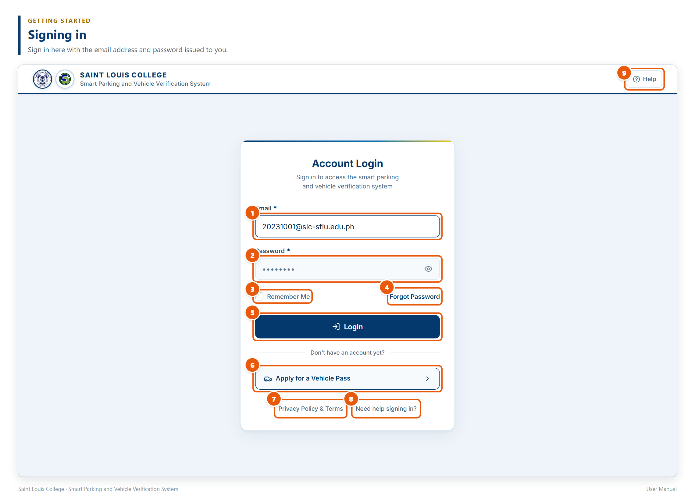

The login page is the entry point for CDSO staff and registered vehicle owners.

1. **Email**: Type the email address registered to your account. It is not case-sensitive.
2. **Password**: Enter your password. The eye icon shows or hides what you typed.
3. **Remember Me**: Keeps you signed in on this computer. Leave it unticked on shared computers.
4. **Forgot Password**: Sends a password-reset link to your email.
5. **Login**: Signs you in. CDSO and vehicle-owner accounts are then asked for a two-factor code.
6. **Apply for a Vehicle Pass**: Starts the online vehicle pass application. No account is needed to apply.
7. **Privacy Policy & Terms**: Opens the data privacy notice and the vehicle pass terms.

### Two-factor verification

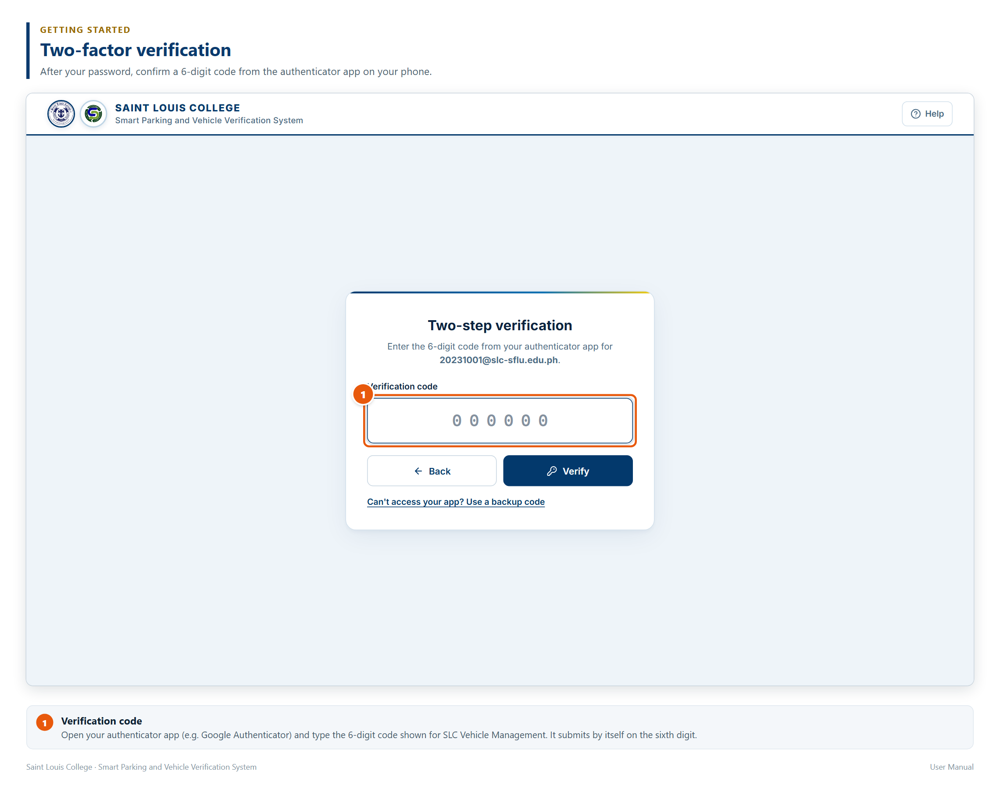

After the password, CDSO and vehicle-owner accounts confirm a 6-digit code from an authenticator app.

1. **Verification code**: Open your authenticator app (e.g. Google Authenticator) and type the 6-digit code shown for SLC Vehicle Management. It submits by itself on the sixth digit.

### Resetting a forgotten password

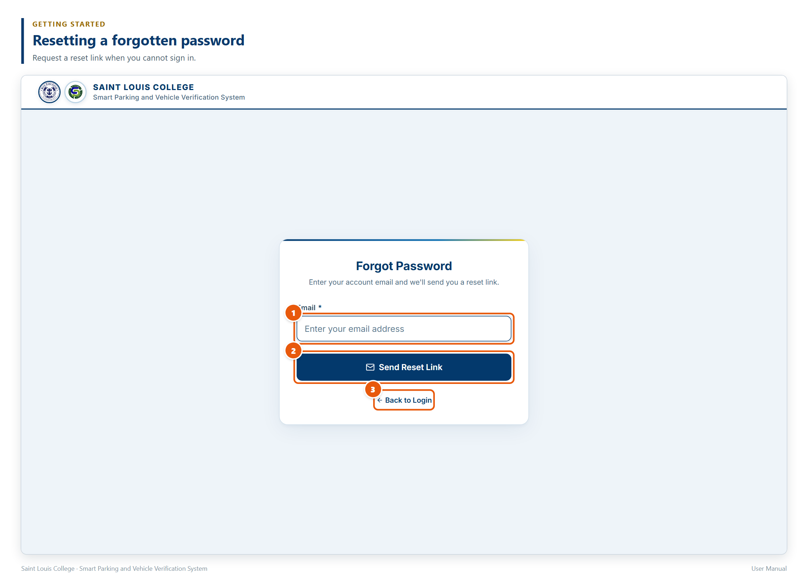

Request a reset link when you cannot sign in.

1. **Email**: Enter the email address of your account.
2. **Send Reset Link**: Emails you a link to choose a new password. The link expires, so use it soon.
3. **Back to Login**: Returns to the login page.

### Applying for a vehicle pass: privacy consent

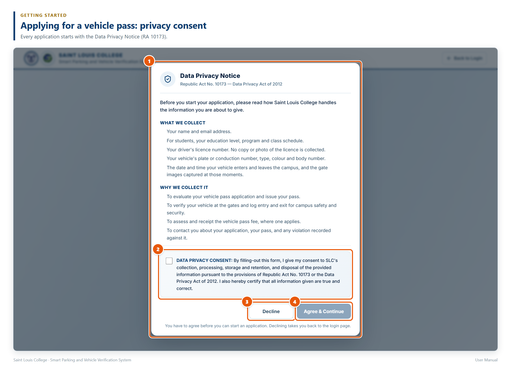

Every application starts with the Data Privacy Notice (RA 10173).

1. **What is collected and why**: Read what information the college collects and how it is used before applying.
2. **Consent checkbox**: Tick to give your consent. Agree & Continue stays disabled until you do.
3. **Decline**: Cancels the application and returns to the login page.
4. **Agree & Continue**: Opens the application form.

### Applying for a vehicle pass: the form

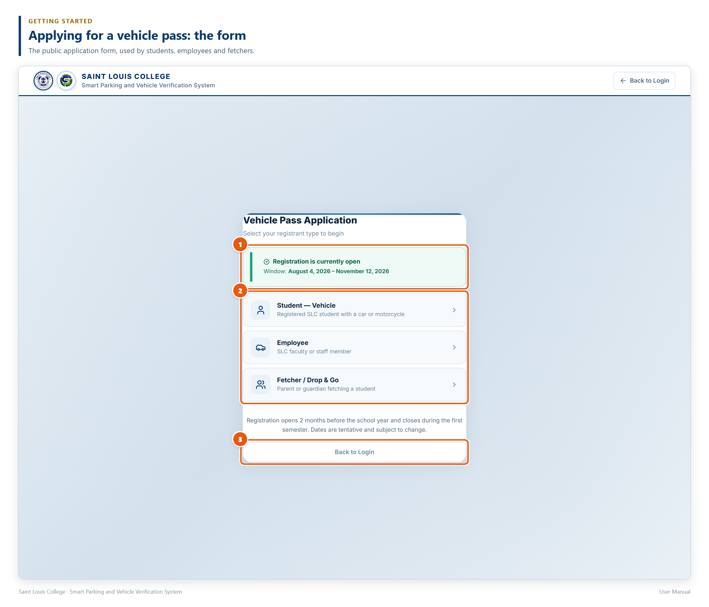

The public application form, used by students, employees and fetchers.

1. **Registration window**: Shows whether applications are being accepted, and the dates of the current window.
2. **Registrant type**: Choose Student — Vehicle, Employee, or Fetcher / Drop & Go. The form that follows asks only for what that type needs.
3. **Back to Login**: Leave the application without submitting.

### Applying for a vehicle pass: student form

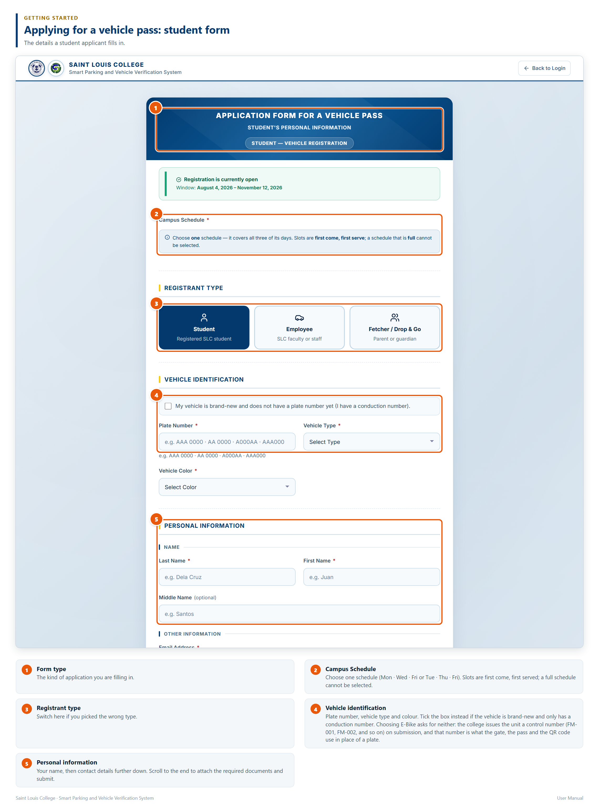

The details a student applicant fills in.

1. **Form type**: The kind of application you are filling in.
2. **Campus Schedule**: Choose one schedule (Mon · Wed · Fri or Tue · Thu · Fri). Slots are first come, first served; a full schedule cannot be selected.
3. **Registrant type**: Switch here if you picked the wrong type.
4. **Vehicle identification**: Plate number, vehicle type and colour. Tick the box instead if the vehicle is brand-new and only has a conduction number.
5. **Personal information**: Your name, then contact details further down. Scroll to the end to attach the required documents and submit.

### Guard sign-in: choosing a gate

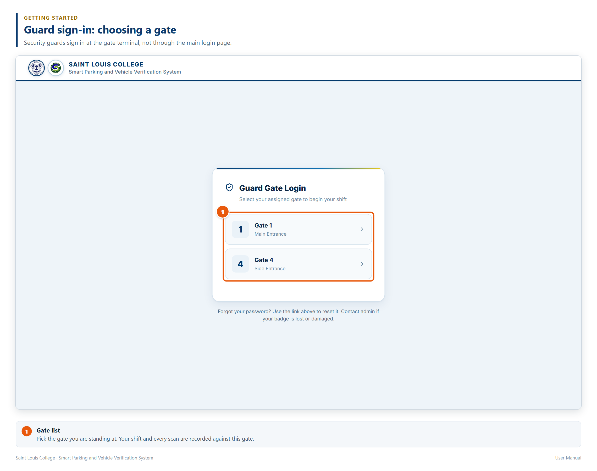

Security guards sign in at the gate terminal, not through the main login page.

1. **Gate list**: Pick the gate you are standing at. Your shift and every scan are recorded against this gate.

### Guard sign-in: clocking in

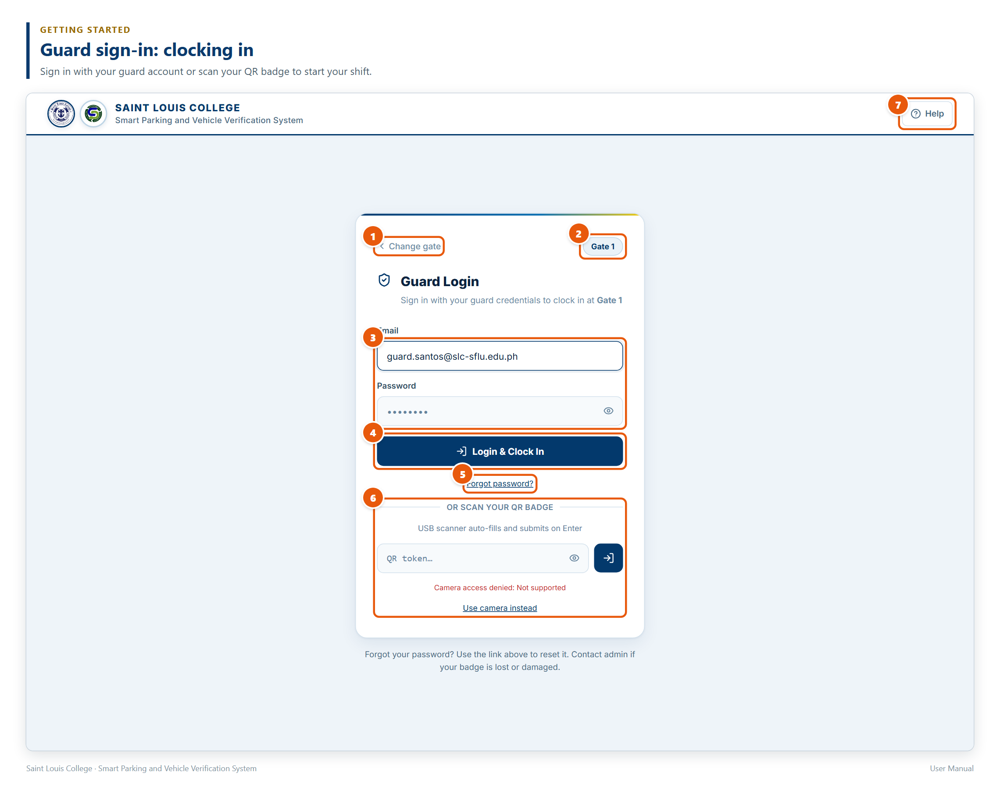

Sign in with your guard account or scan your QR badge to start your shift.

1. **Change gate**: Go back if you picked the wrong gate.
2. **Selected gate**: The gate you will be clocked in at.
3. **Email and password**: Your guard account credentials.
4. **Login & Clock In**: Signs you in and starts your shift at this gate. Whoever was on duty here is signed out.
5. **Forgot password?**: Sends a reset link to your email.
6. **QR badge**: Appears when your account has a badge. Scan it with a USB scanner or the camera instead of typing the password.

## CDSO (Administrator)

Every screen available to the CDSO (administrator) account.

### CDSO dashboard and screen layout

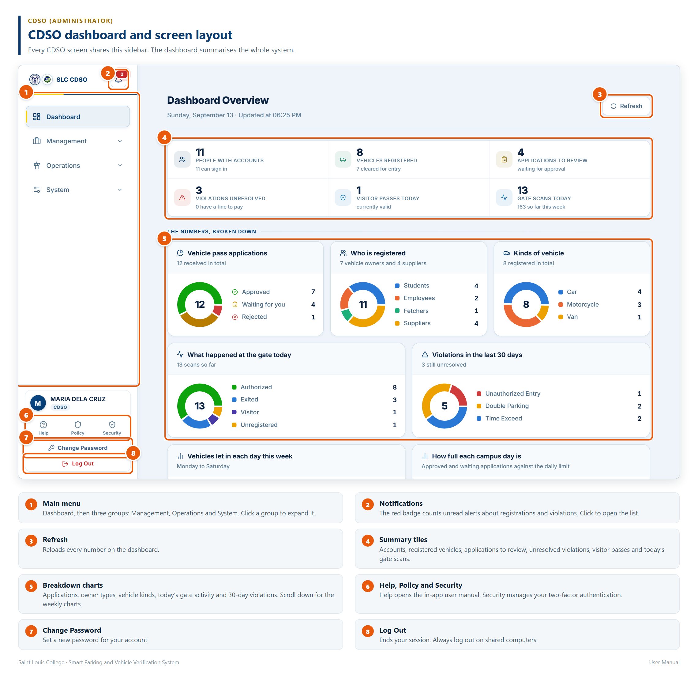

Every CDSO screen shares this sidebar. The dashboard summarises the whole system.

1. **Main menu**: Dashboard, then three groups: Management, Operations and System. Click a group to expand it.
2. **Notifications**: The red badge counts unread alerts about registrations and violations. Click to open the list.
3. **Refresh**: Reloads every number on the dashboard.
4. **Summary tiles**: Accounts, registered vehicles, applications to review, unresolved violations, visitor passes and today’s gate scans.
5. **Breakdown charts**: Applications, owner types, vehicle kinds, today’s gate activity and 30-day violations. Scroll down for the weekly charts.
6. **Help, Policy and Security**: Help opens the in-app user manual. Security manages your two-factor authentication.
7. **Change Password**: Set a new password for your account.
8. **Log Out**: Ends your session. Always log out on shared computers.

### Notifications

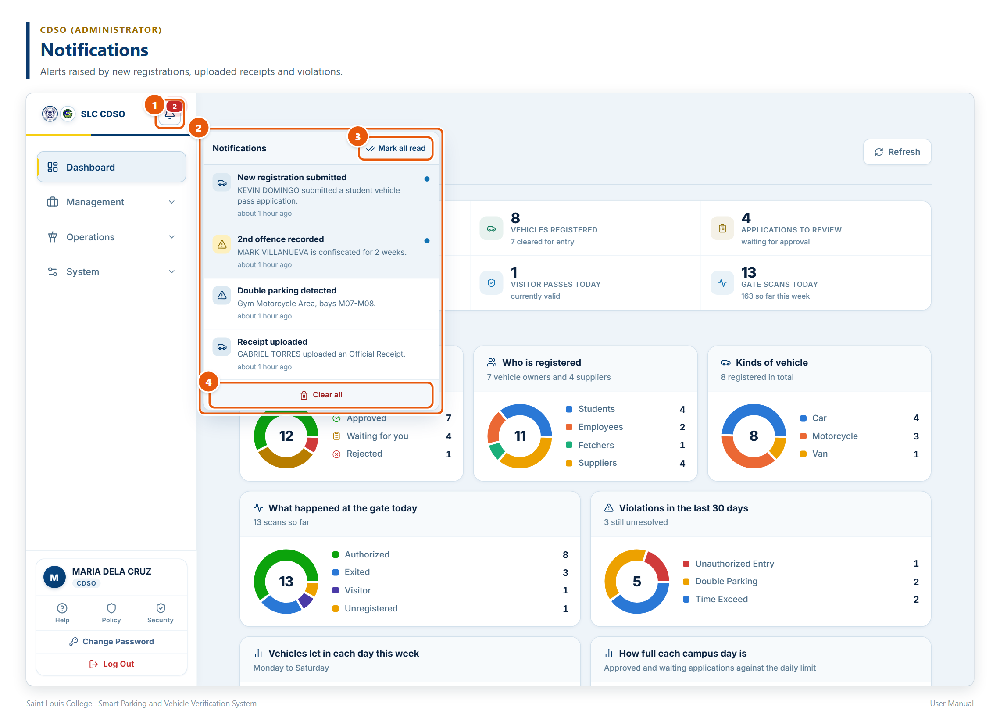

Alerts raised by new registrations, uploaded receipts and violations.

1. **Bell**: The number is how many notifications you have not read yet.
2. **Notification list**: Newest first. A blue dot marks an unread item; click one to open the screen it is about.
3. **Mark all read**: Clears the unread dots and the badge without deleting anything.
4. **Clear all**: Removes every notification from the list.

### Vehicle Registration Management

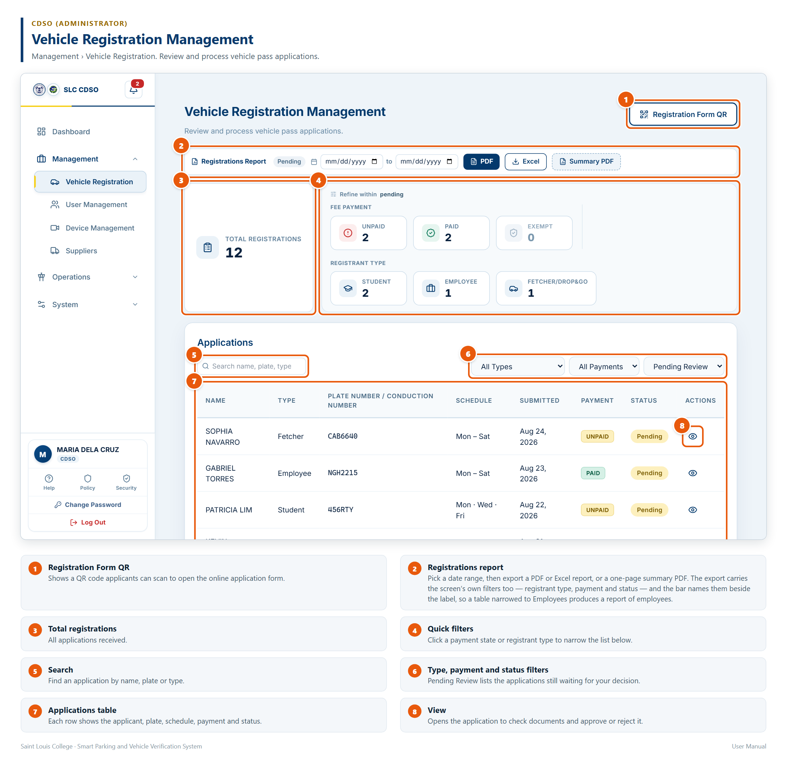

Management › Vehicle Registration. Review and process vehicle pass applications.

1. **Registration Form QR**: Shows a QR code applicants can scan to open the online application form.
2. **Registrations report**: Pick a date range, then download a PDF or Excel report, or a one-page summary PDF.
3. **Total registrations**: All applications received.
4. **Quick filters**: Click a payment state or registrant type to narrow the list below.
5. **Search**: Find an application by name, plate or type.
6. **Type, payment and status filters**: Pending Review lists the applications still waiting for your decision.
7. **Applications table**: Each row shows the applicant, plate, schedule, payment and status.
8. **View**: Opens the application to check documents and approve or reject it.

### Reviewing an application

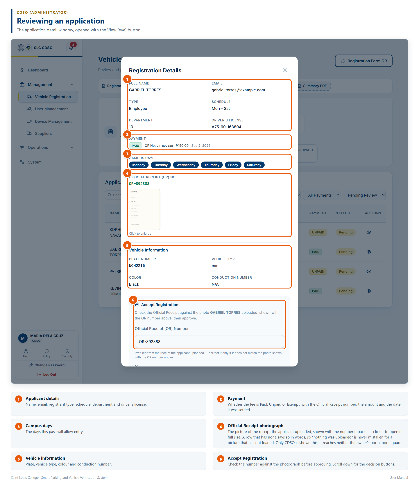

The application detail window, opened with the View (eye) button.

1. **Applicant details**: Name, email, registrant type, schedule, department and driver’s license.
2. **Payment**: Whether the fee is paid, the Official Receipt number, amount and date.
3. **Campus days**: The days this pass will allow entry.
4. **Vehicle information**: Plate, vehicle type, colour and conduction number.
5. **Accept Registration**: Check the receipt against the uploaded photo before approving. Scroll down for the documents and the decision buttons.

### Approving or rejecting an application

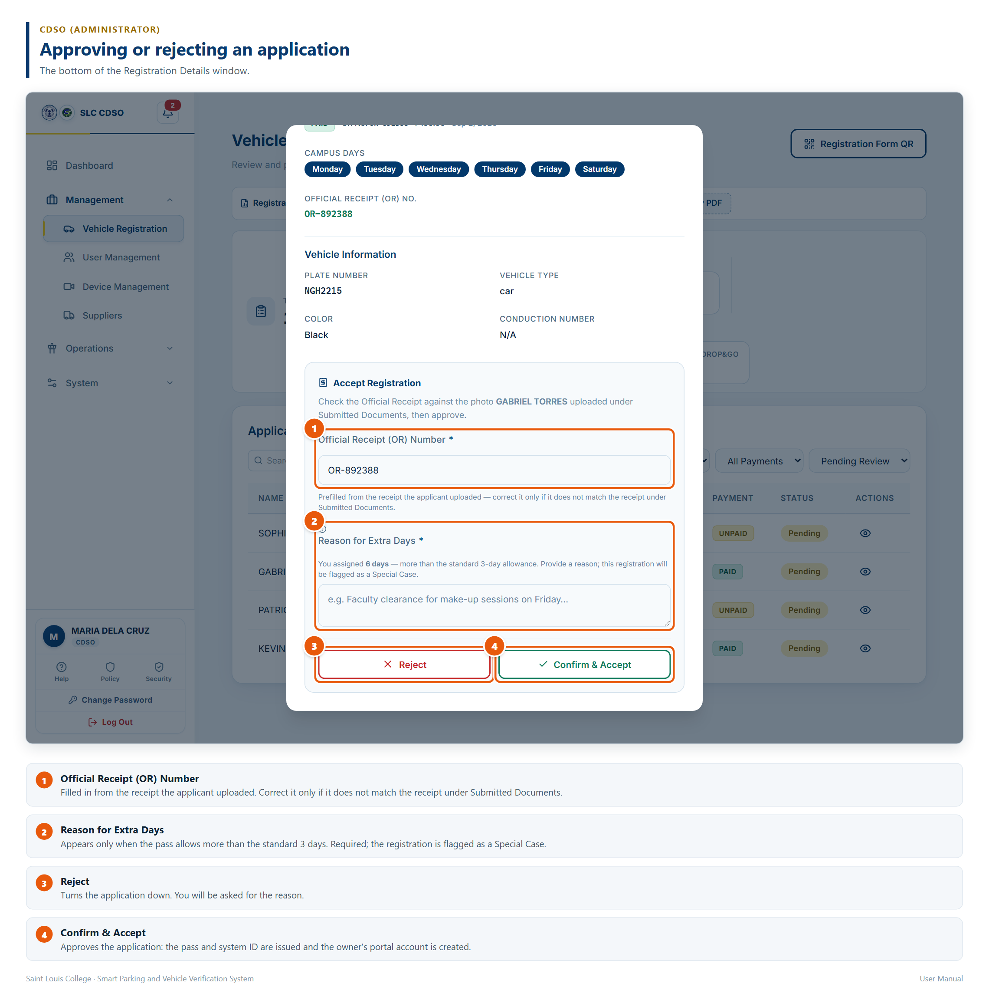

The bottom of the Registration Details window.

1. **Official Receipt (OR) Number**: Filled in from the receipt the applicant uploaded. Correct it only if it does not match the receipt under Submitted Documents.
2. **Reason for Extra Days**: Appears only when the pass allows more than the standard 3 days. Required; the registration is flagged as a Special Case.
3. **Reject**: Turns the application down. You will be asked for the reason.
4. **Confirm & Accept**: Approves the application: the pass and system ID are issued and the owner’s portal account is created.

### User Management

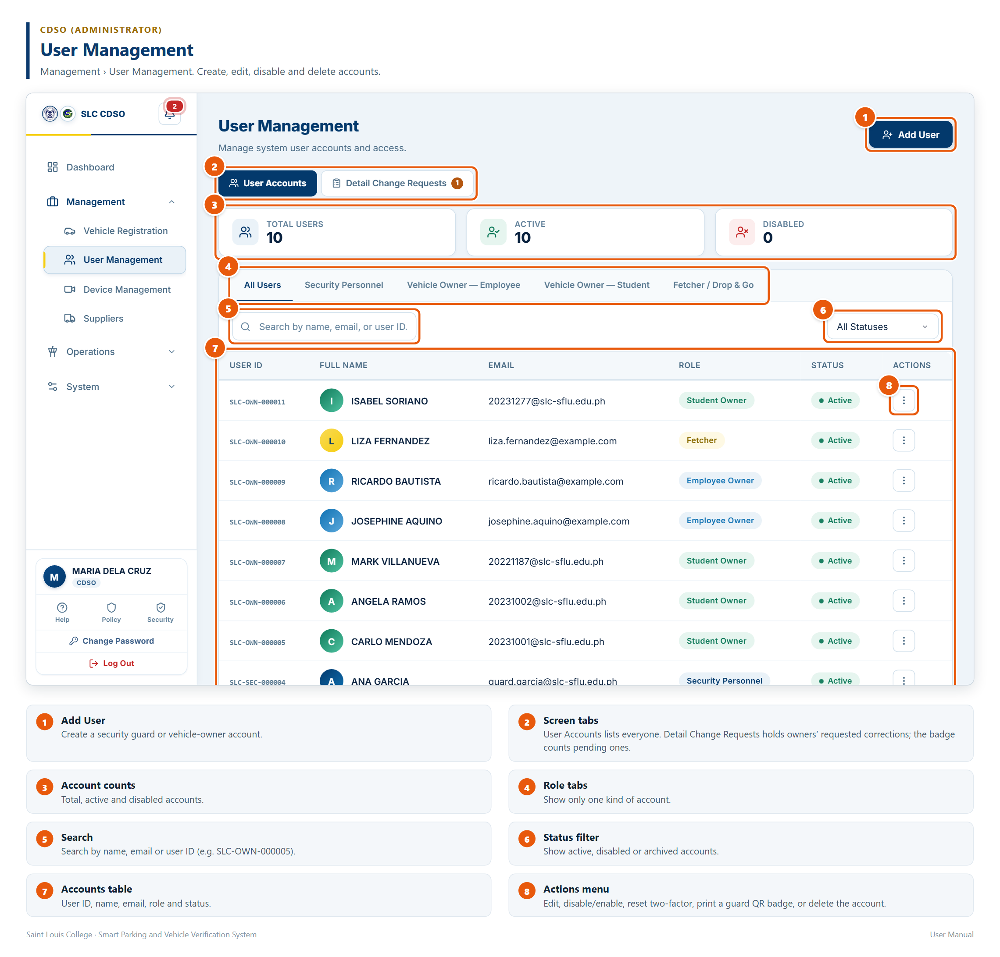

Management › User Management. Create, edit, disable and delete accounts.

1. **Add User**: Create a security guard or vehicle-owner account.
2. **Screen tabs**: User Accounts lists everyone. Detail Change Requests holds owners’ requested corrections; the badge counts pending ones.
3. **Account counts**: Total, active and disabled accounts.
4. **Role tabs**: Show only one kind of account.
5. **Search**: Search by name, email or user ID (e.g. SLC-OWN-000005).
6. **Status filter**: Show active, disabled or archived accounts.
7. **Accounts table**: User ID, name, email, role and status.
8. **Actions menu**: Edit, disable/enable, reset two-factor, print a guard QR badge, or delete the account.

### Approving detail change requests

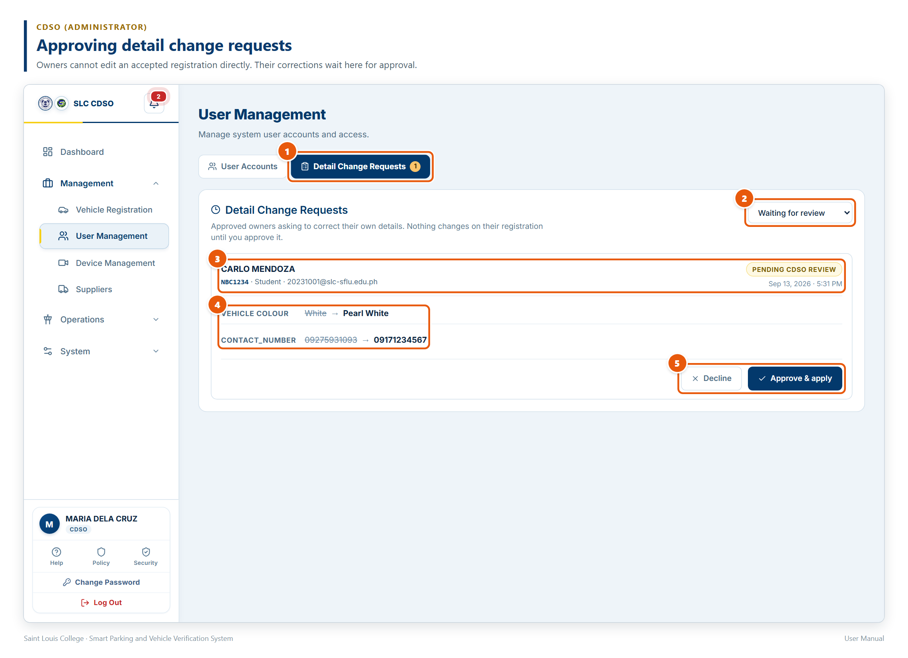

Owners cannot edit an accepted registration directly. Their corrections wait here for approval.

1. **Detail Change Requests tab**: The badge counts requests waiting for your review.
2. **Status filter**: Show requests waiting for review, or ones already decided.
3. **Who is asking**: Owner name, plate, registrant type, email, and when the request was filed.
4. **Requested changes**: Each field shows the current value struck through and the new value the owner wants.
5. **Decline / Approve & apply**: Approve & apply updates the registration. Decline leaves it unchanged. The owner is emailed either way.

### Device Management (cameras)

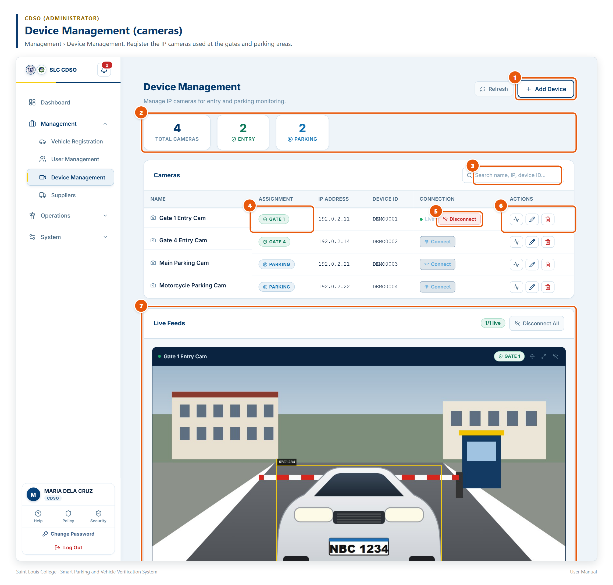

Management › Device Management. Register the IP cameras used at the gates and parking areas.

1. **Add Device**: Register a new camera: name, IP address, device ID, password and whether it watches a gate or a parking area.
2. **Camera counts**: How many cameras are registered, and how many cover entry gates and parking.
3. **Search**: Find a camera by name, IP address or device ID.
4. **Assignment**: The gate or parking area this camera covers.
5. **Connect / Disconnect**: Opens or closes the camera’s live picture in Live Feeds below.
6. **Test, Edit, Delete**: Check the camera answers, change its settings, or remove it.
7. **Live Feeds**: Live pictures from the cameras you connected. (Sample picture shown.)

### Supplier Management

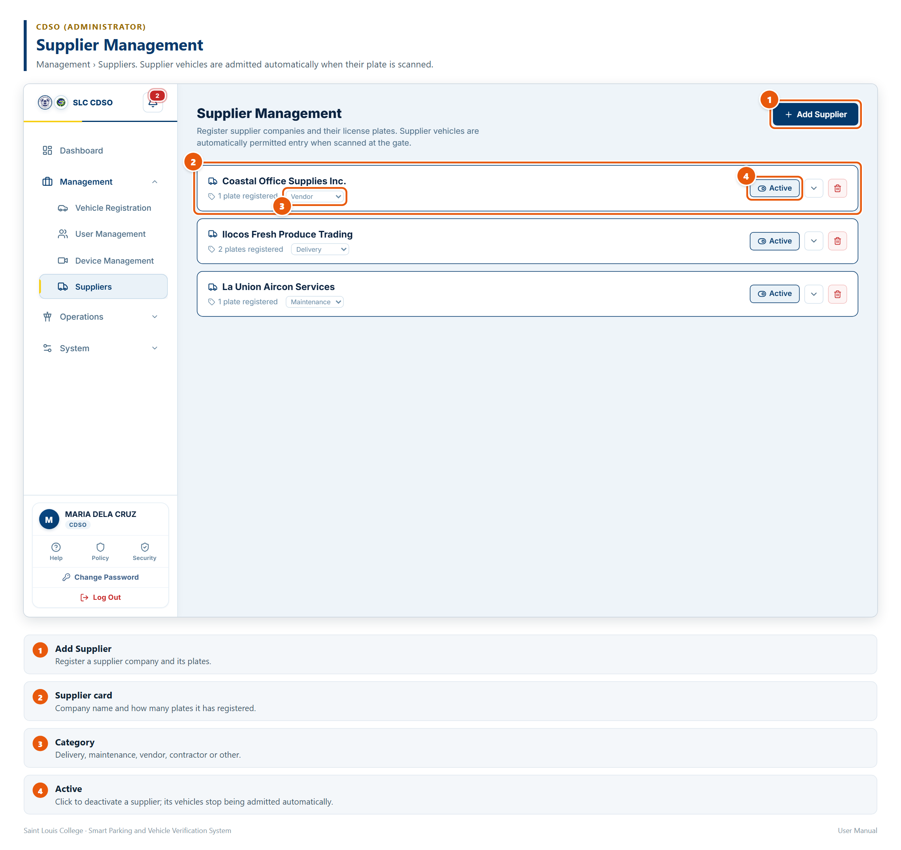

Management › Suppliers. Supplier vehicles are admitted automatically when their plate is scanned.

1. **Add Supplier**: Register a supplier company and its plates.
2. **Supplier card**: Company name and how many plates it has registered.
3. **Category**: Delivery, maintenance, vendor, contractor or other.
4. **Active**: Click to deactivate a supplier; its vehicles stop being admitted automatically.

### Operations Center: live monitor

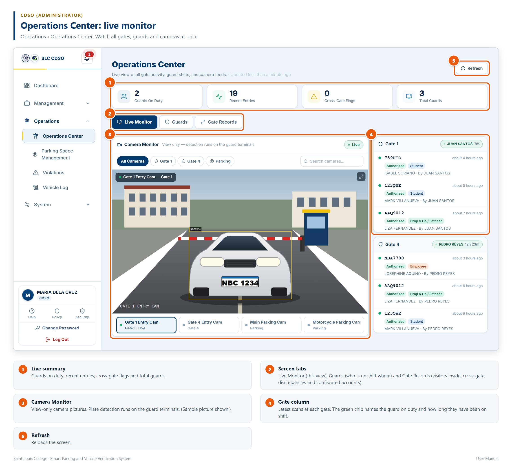

Operations › Operations Center. Watch all gates, guards and cameras at once.

1. **Live summary**: Guards on duty, recent entries, cross-gate flags and total guards.
2. **Screen tabs**: Live Monitor (this view), Guards (who is on shift where) and Gate Records (visitors inside, cross-gate discrepancies and confiscated accounts).
3. **Camera Monitor**: View-only camera pictures. Plate detection runs on the guard terminals. (Sample picture shown.)
4. **Gate column**: Latest scans at each gate. The green chip names the guard on duty and how long they have been on shift.
5. **Refresh**: Reloads the screen.

### Operations Center: guards

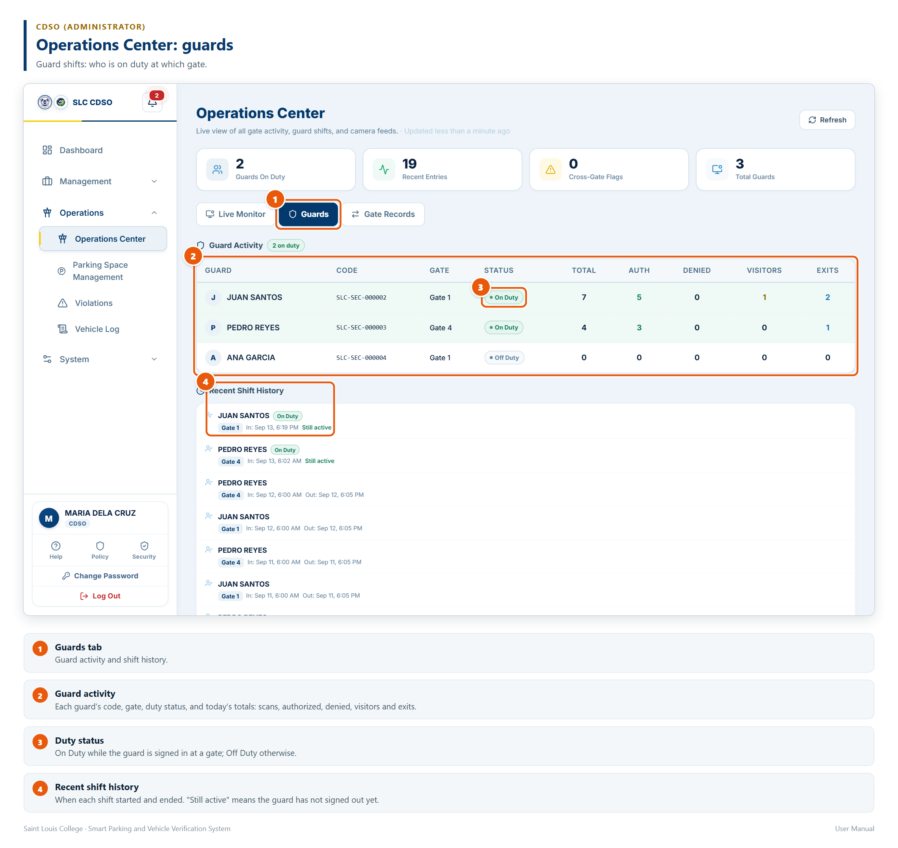

Guard shifts: who is on duty at which gate.

1. **Guards tab**: Guard activity and shift history.
2. **Guard activity**: Each guard’s code, gate, duty status, and today’s totals: scans, authorized, denied, visitors and exits.
3. **Duty status**: On Duty while the guard is signed in at a gate; Off Duty otherwise.
4. **Recent shift history**: When each shift started and ended. "Still active" means the guard has not signed out yet.

### Operations Center: gate records

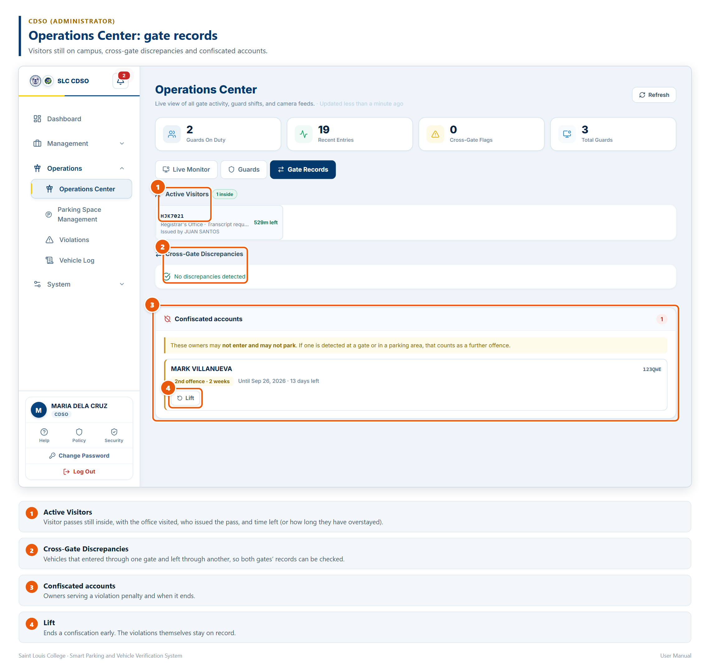

Visitors still on campus, cross-gate discrepancies and confiscated accounts.

1. **Active Visitors**: Visitor passes still inside, with the office visited, who issued the pass, and time left (or how long they have overstayed).
2. **Cross-Gate Discrepancies**: Vehicles that entered through one gate and left through another, so both gates’ records can be checked.
3. **Confiscated accounts**: Owners serving a violation penalty and when it ends.
4. **Lift**: Ends a confiscation early. The violations themselves stay on record.

### Parking Space Management

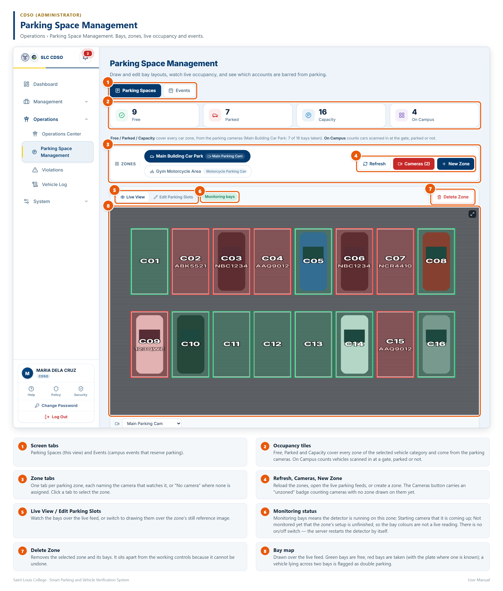

Operations › Parking Space Management. Bays, zones, live occupancy and events.

1. **Screen tabs**: Parking Spaces (this view) and Events (campus events that reserve parking).
2. **Occupancy tiles**: Free, Occupied and Capacity come from gate scans. Bays Taken is what the camera sees in the selected zone.
3. **Zones**: Each parking zone and the camera watching it. Click a zone to select it.
4. **Refresh, Cameras, New Zone**: Reload, manage the parking cameras, or draw a new zone.
5. **Live View / Edit Parking Slots**: Switch between watching the bays and drawing or adjusting them.
6. **Delete Zone**: Removes the selected zone and its bays.
7. **Bay map**: Green bays are free, red bays are taken (with the plate when known).

### Drawing parking bays

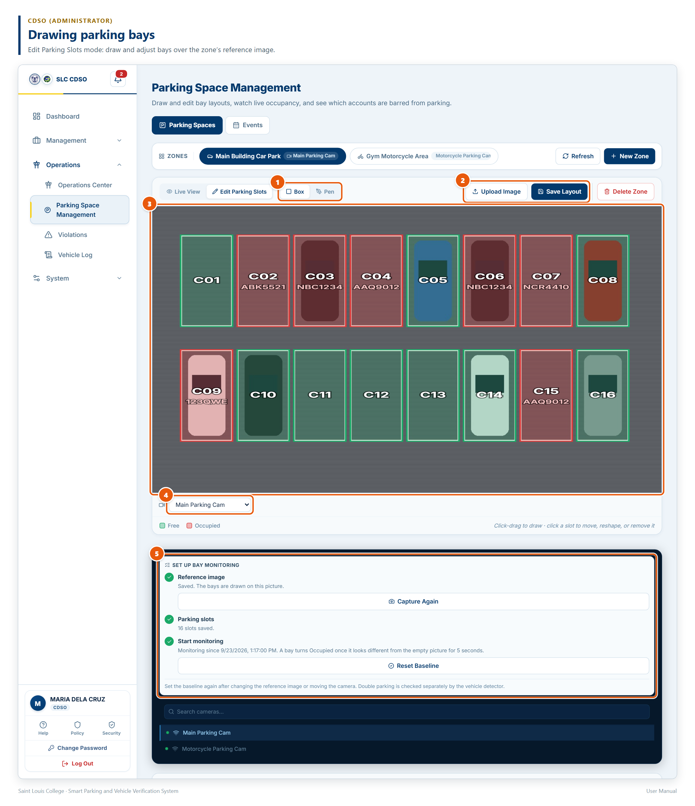

Edit Parking Slots mode: draw and adjust bays over the camera picture.

1. **Drawing tools**: Box draws rectangular bays; Pen draws a free-form outline for angled bays.
2. **Upload Image / Save Layout**: Upload a reference picture of the lot, and save the bays when you are done.
3. **Drawing area**: Click and drag to draw a bay. Click a bay to rename or delete it.
4. **Camera**: The camera whose picture the bays are drawn over.
5. **Use as Reference Image**: Takes the current camera picture as this zone’s reference image.

### Campus events

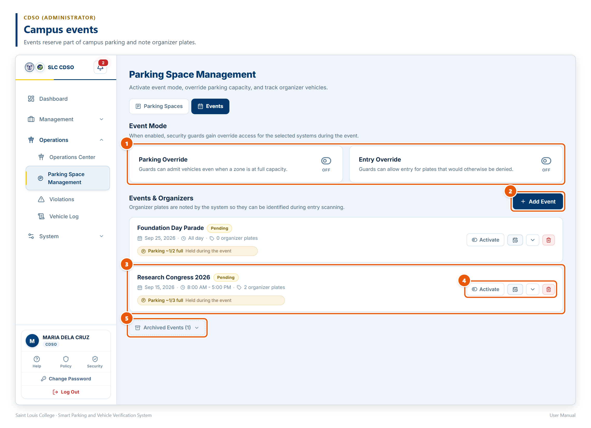

Events reserve part of campus parking and note organizer plates.

1. **Event Mode overrides**: Parking Override lets guards admit vehicles when a zone is full; Entry Override lets them admit plates that would be denied. Click the switch to turn each on or off.
2. **Add Event**: Create an event: name, date, times, how much parking it takes, and organizer plates.
3. **Event card**: Date, time, organizer plates, and how much of campus parking the event holds.
4. **Event actions**: Activate the event, reschedule it, show its details, or delete it.
5. **Archived Events**: Past events, kept for reference.

### Violations

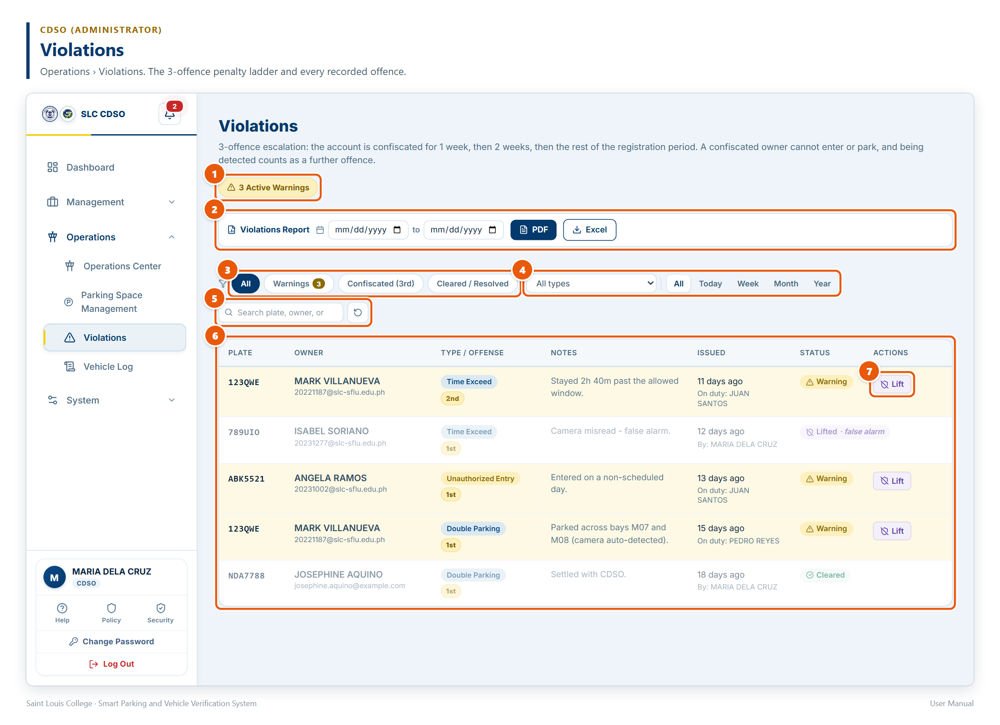

Operations › Violations. The 3-offence penalty ladder and every recorded offence.

1. **Active warnings**: How many violations are still counting against their owners.
2. **Violations report**: Pick a date range and download a PDF or Excel report.
3. **Status filter**: All, Warnings, Confiscated (3rd offence) or Cleared / Resolved.
4. **Type and period**: Filter by violation type, and by Today, Week, Month or Year.
5. **Search**: Find by plate, owner or notes. The arrow button resets all filters.
6. **Violations table**: Plate, owner, type with offence number (1st, 2nd, 3rd), notes, evidence photo, when it was issued and by whom.
7. **Lift**: Voids a violation as a false alarm. It stops counting, and later offences are renumbered.

### Vehicle Log

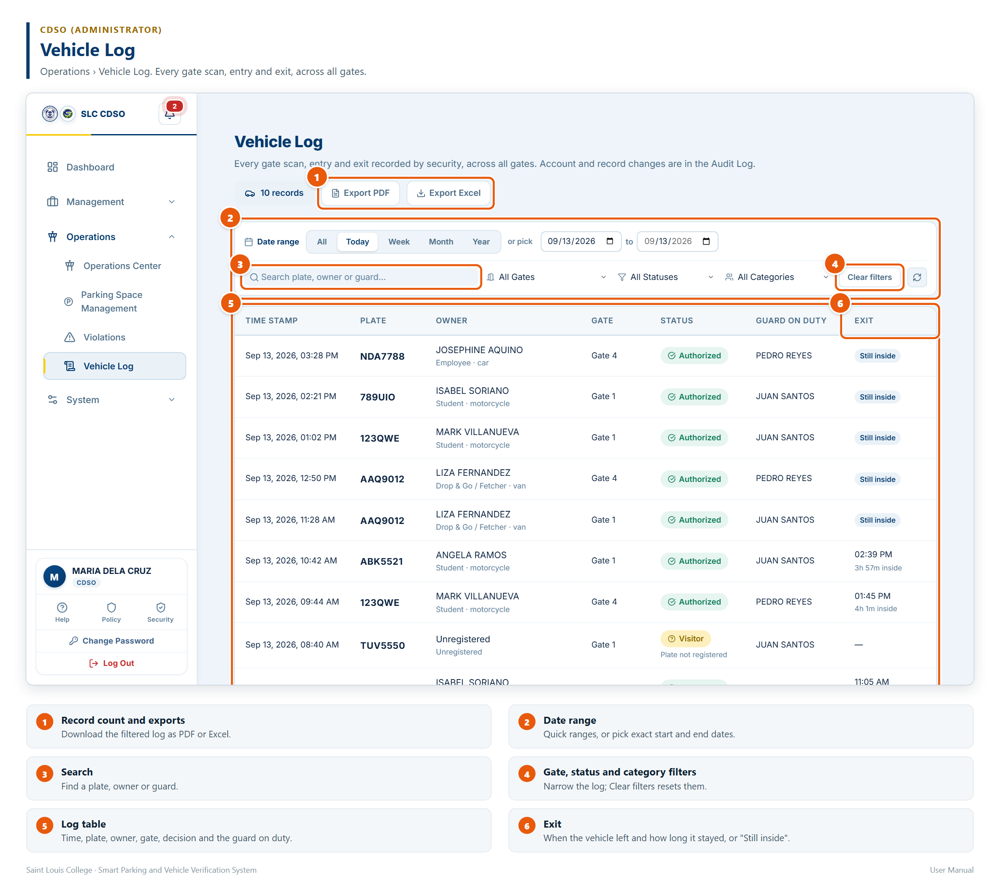

Operations › Vehicle Log. Every gate scan, entry and exit, across all gates.

1. **Record count and exports**: Download the filtered log as PDF or Excel.
2. **Date range**: Quick ranges, or pick exact start and end dates.
3. **Search**: Find a plate, owner or guard.
4. **Gate, status and category filters**: Narrow the log; Clear filters resets them.
5. **Log table**: Time, plate, owner, gate, decision and the guard on duty.
6. **Exit**: When the vehicle left and how long it stayed, or "Still inside".

### Rule Constraints: entry rules

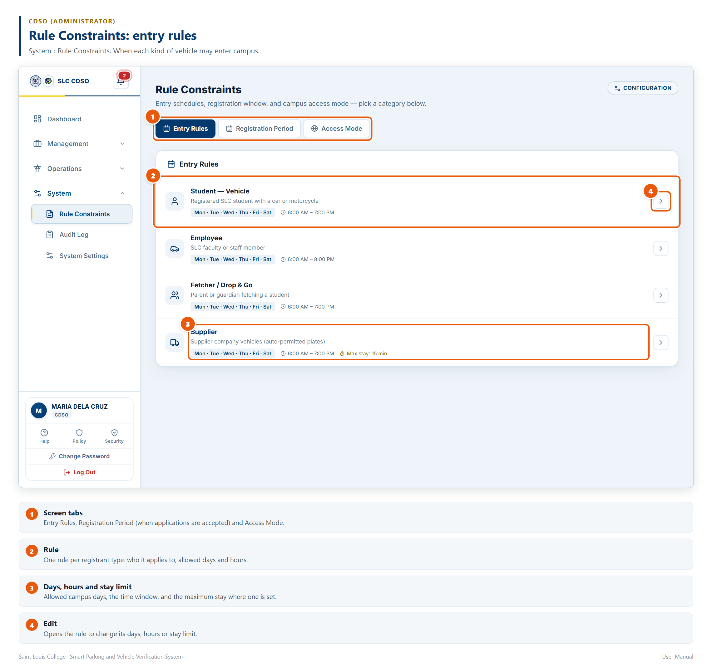

System › Rule Constraints. When each kind of vehicle may enter campus.

1. **Screen tabs**: Entry Rules, Registration Period (when applications are accepted) and Access Mode.
2. **Rule**: One rule per registrant type: who it applies to, allowed days and hours.
3. **Days, hours and stay limit**: Allowed campus days, the time window, and the maximum stay where one is set.
4. **Edit**: Opens the rule to change its days, hours or stay limit.

### Rule Constraints: registration period

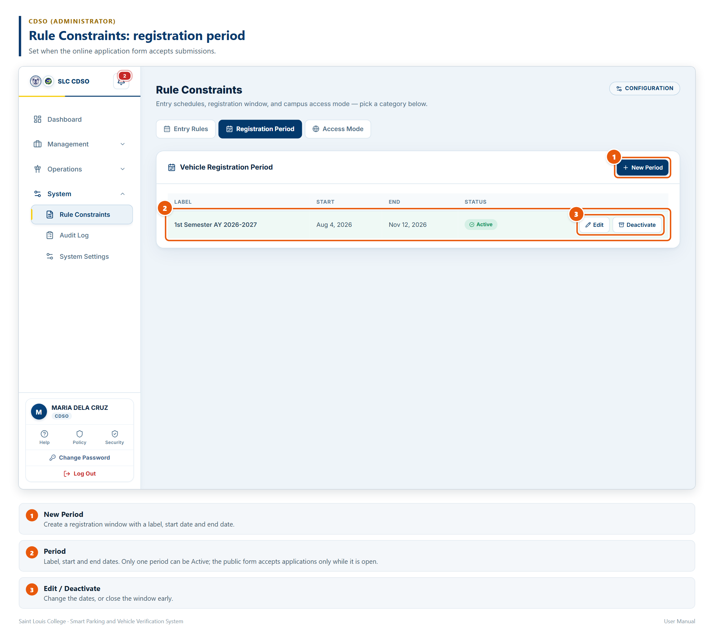

Set when the online application form accepts submissions.

1. **New Period**: Create a registration window with a label, start date and end date.
2. **Period**: Label, start and end dates. Only one period can be Active; the public form accepts applications only while it is open.
3. **Edit / Deactivate**: Change the dates, or close the window early.

### Rule Constraints: access mode

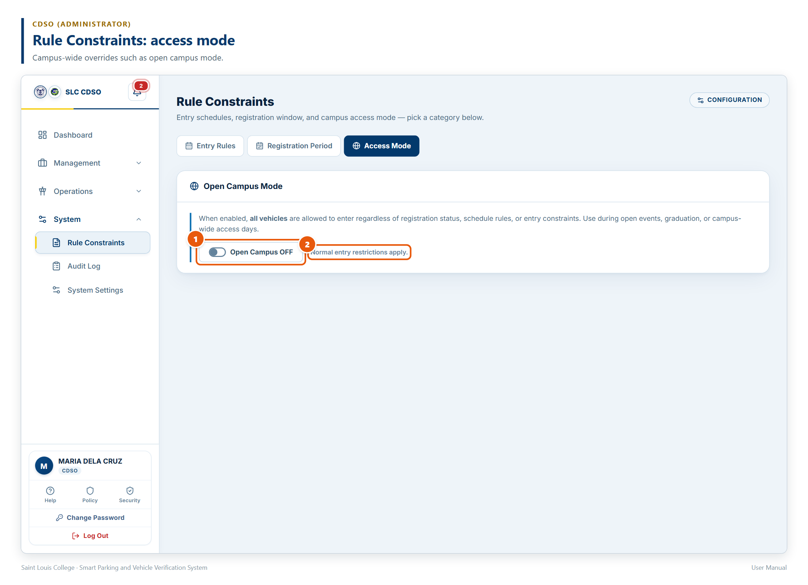

Campus-wide overrides such as open campus mode.

1. **Open Campus switch**: When ON, every vehicle may enter regardless of registration, schedule or entry rules. Use it for open events or graduation, and switch it OFF afterwards.
2. **Current effect**: What the setting means right now.

### Audit Log

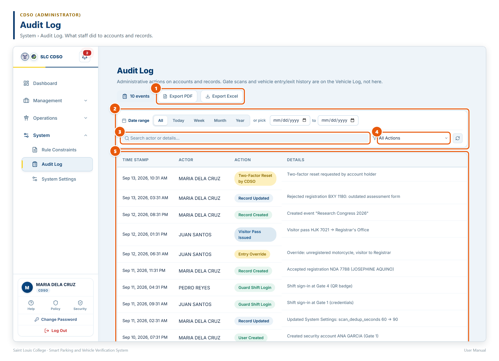

System › Audit Log. What staff did to accounts and records.

1. **Event count and exports**: Download the filtered log as PDF or Excel.
2. **Date range**: All, Today, Week, Month, Year, or exact dates.
3. **Search**: Search by the staff member’s name or the details text.
4. **Action filter**: Show one kind of action, e.g. User Created or Entry Override.
5. **Audit table**: When, who, what kind of action, and the details.

### System Settings: accounts & fees

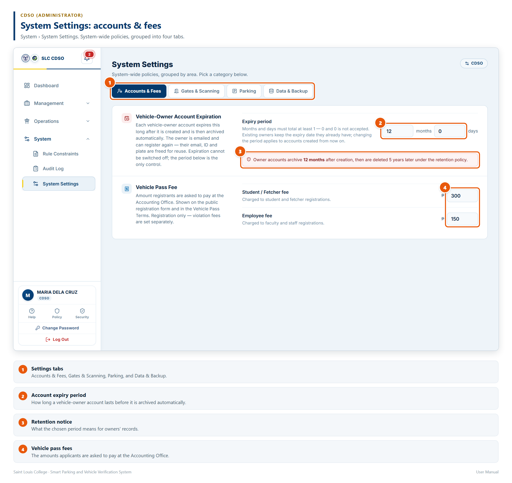

System › System Settings. System-wide policies, grouped into four tabs.

1. **Settings tabs**: Accounts & Fees, Gates & Scanning, Parking, and Data & Backup.
2. **Account expiry period**: How long a vehicle-owner account lasts before it is archived automatically.
3. **Retention notice**: What the chosen period means for owners’ records.
4. **Vehicle pass fees**: The amounts applicants are asked to pay at the Accounting Office.

### System Settings: gates & scanning

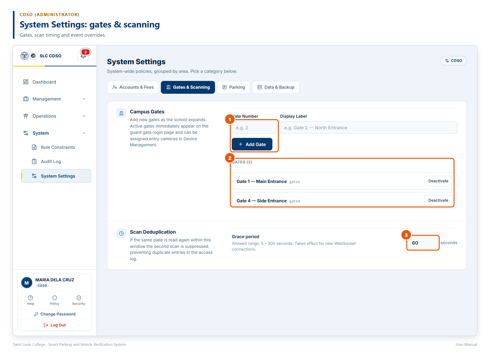

Gates, scan timing and event overrides.

1. **Add a gate**: Enter the gate number and a display label, then Add Gate. It appears on the guard sign-in page straight away.
2. **Gate list**: Every gate. Deactivate removes a gate from the sign-in page without deleting its history.
3. **Scan deduplication**: If the same plate is read again within this many seconds, the repeat is ignored so it is not logged twice.

### System Settings: parking

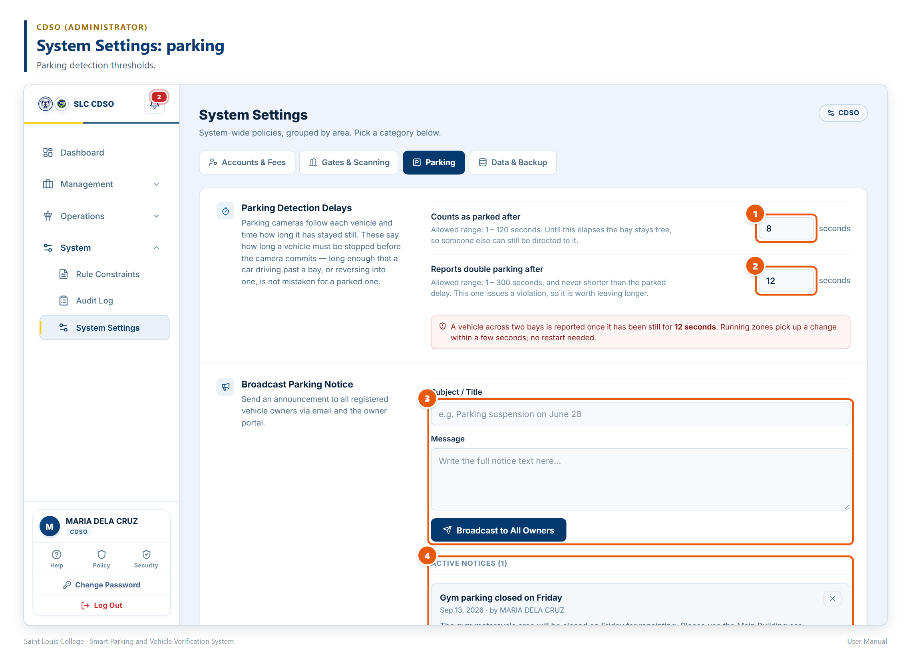

Parking detection thresholds.

1. **Counts as parked after**: How long a vehicle must stay still before its bay counts as taken.
2. **Reports double parking after**: How long a vehicle must sit across two bays before a double-parking violation is issued.
3. **Broadcast Parking Notice**: Write a subject and message, then Broadcast to All Owners. It is emailed and shown in every owner’s portal.
4. **Active notices**: Notices owners can currently see. The × removes one.

### System Settings: data & backup

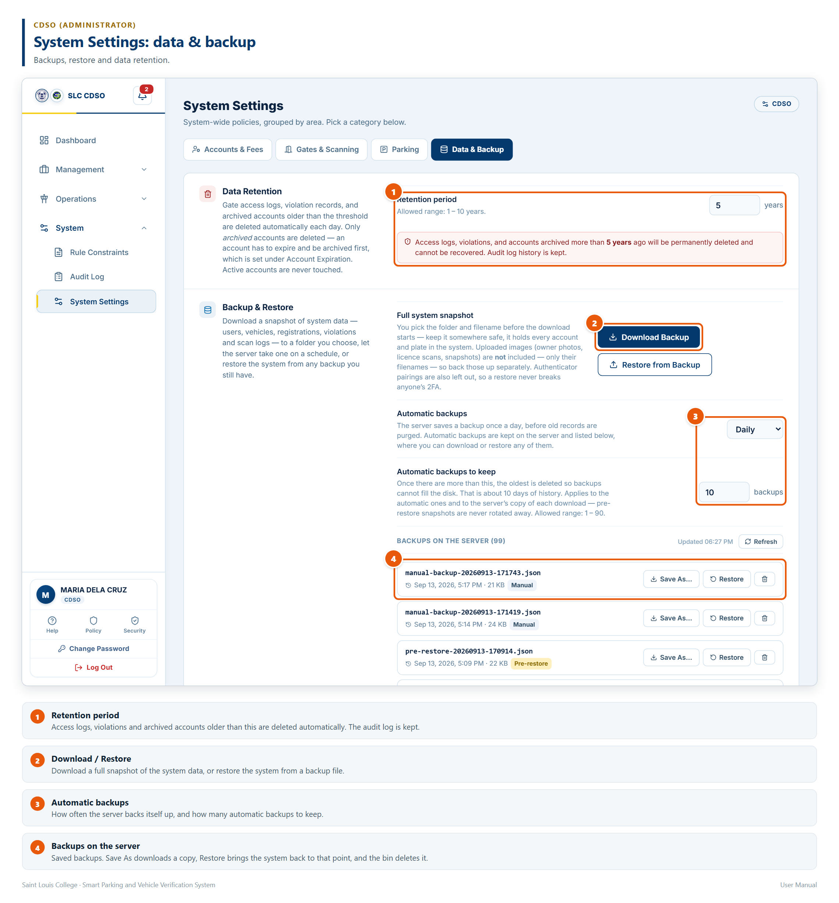

Backups, restore and data retention.

1. **Retention period**: Access logs, violations and archived accounts older than this are deleted automatically. The audit log is kept.
2. **Download / Restore**: Download a full snapshot of the system data, or restore the system from a backup file.
3. **Automatic backups**: How often the server backs itself up, and how many automatic backups to keep.
4. **Backups on the server**: Saved backups. Save As downloads a copy, Restore brings the system back to that point, and the bin deletes it.

### Help & User Manual

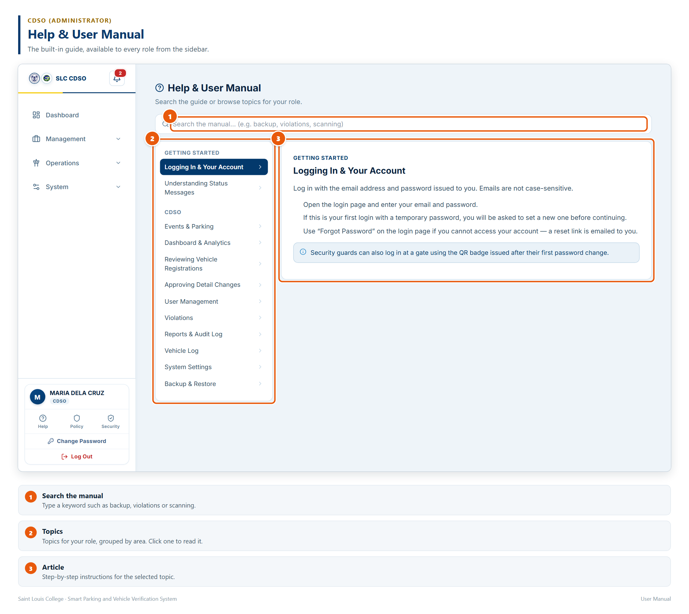

The built-in guide, available to every role from the sidebar.

1. **Search the manual**: Type a keyword such as backup, violations or scanning.
2. **Topics**: Topics for your role, grouped by area. Click one to read it.
3. **Article**: Step-by-step instructions for the selected topic.

## Security Guard

The gate terminal used by security guards.

### Entry Management (gate terminal)

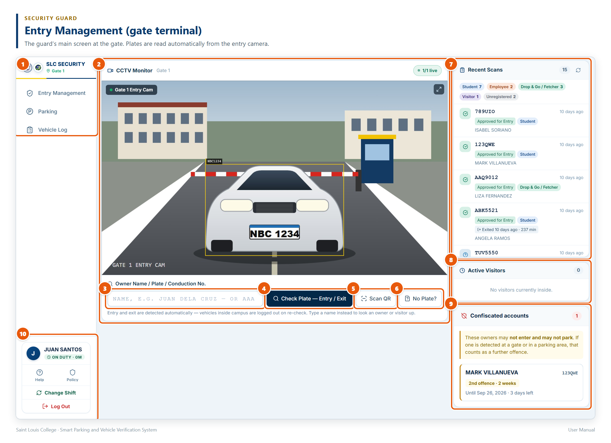

The guard’s main screen at the gate. Plates are read automatically from the entry camera.

1. **Menu and gate**: Entry Management, Parking and Vehicle Log. The green tag shows the gate you are clocked in at.
2. **CCTV Monitor**: Live picture from this gate’s entry camera. Detected plates are boxed and checked automatically. (Sample picture shown.)
3. **Owner name / plate search**: Type a plate, conduction number or owner name when a plate is not read automatically.
4. **Check Plate — Entry / Exit**: Checks the typed plate. A vehicle already inside is logged out; otherwise its entry is checked against its pass and schedule.
5. **Scan QR**: Scan the QR code on the owner’s vehicle pass or a visitor slip.
6. **No Plate?**: Record a vehicle with no plate or conduction sticker by describing it.
7. **Recent Scans**: Latest decisions at this gate. The chips count entries by category.
8. **Active Visitors**: Visitor passes still inside, with time left. +30m extends a pass.
9. **Confiscated accounts**: Owners serving a violation penalty. They may not enter or park.
10. **Shift controls**: On-duty timer, Help, Policy, Change Shift (hand over the gate) and Log Out.

### Checking a plate

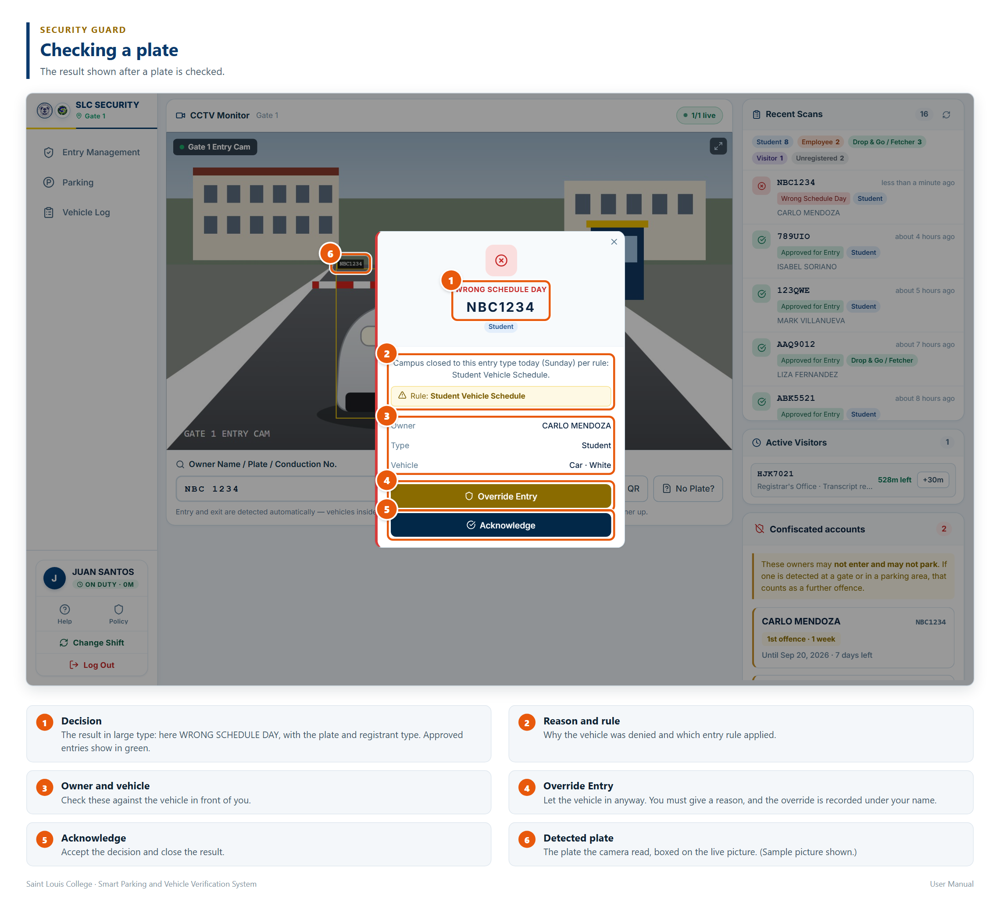

The result shown after a plate is checked.

1. **Decision**: The result in large type: here WRONG SCHEDULE DAY, with the plate and registrant type. Approved entries show in green.
2. **Reason and rule**: Why the vehicle was denied and which entry rule applied.
3. **Owner and vehicle**: Check these against the vehicle in front of you.
4. **Override Entry**: Let the vehicle in anyway. You must give a reason, and the override is recorded under your name.
5. **Acknowledge**: Accept the decision and close the result.
6. **Detected plate**: The plate the camera read, boxed on the live picture. (Sample picture shown.)

### Recording a vehicle with no plate

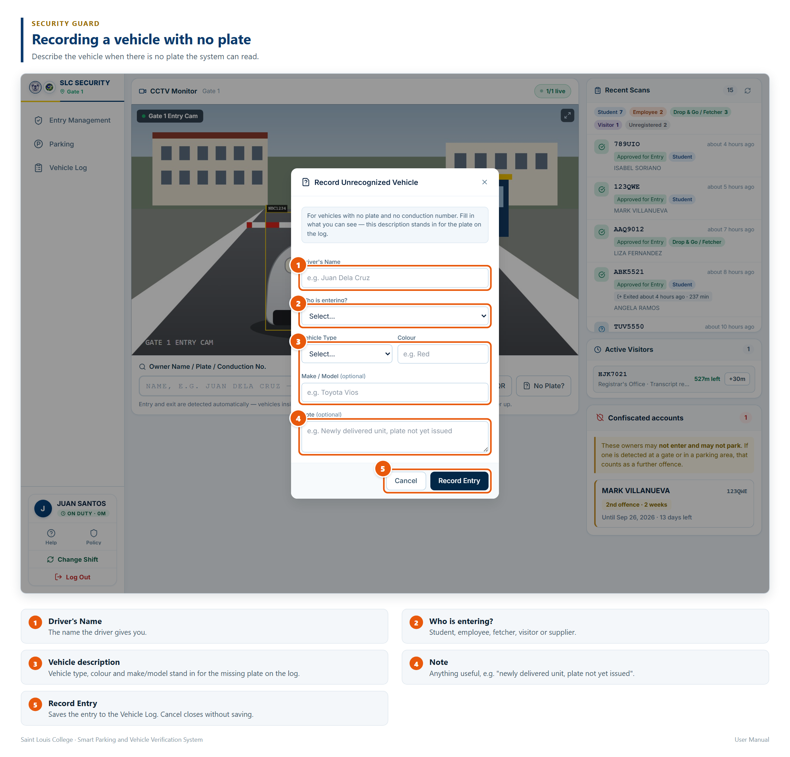

Describe the vehicle when there is no plate the system can read.

1. **Driver's Name**: The name the driver gives you.
2. **Who is entering?**: Student, employee, fetcher, visitor or supplier.
3. **Vehicle description**: Vehicle type, colour and make/model stand in for the missing plate on the log.
4. **Note**: Anything useful, e.g. "newly delivered unit, plate not yet issued".
5. **Record Entry**: Saves the entry to the Vehicle Log. Cancel closes without saving.

### Parking monitor

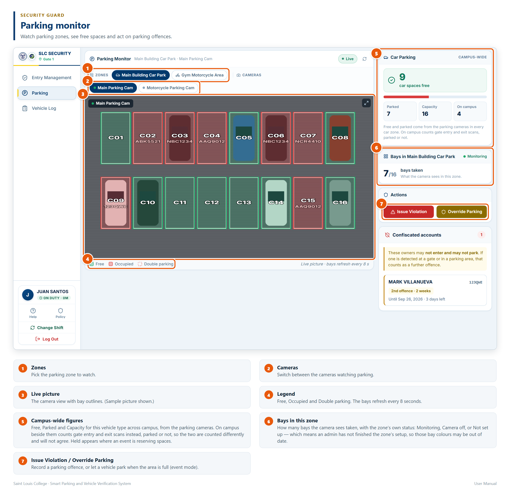

Watch parking zones, see free spaces and act on parking offences.

1. **Zones**: Pick the parking zone to watch.
2. **Cameras**: Switch between the cameras watching parking.
3. **Live picture**: The camera view with bay outlines. (Sample picture shown.)
4. **Legend**: Free, Occupied, and Vehicle seen (a vehicle the camera is tracking).
5. **Campus-wide spaces**: Free spaces for this vehicle type across campus, counted from gate entries and exits.
6. **Bays in this zone**: How many bays the camera sees taken.
7. **Issue Violation / Override Parking**: Record a parking offence, or let a vehicle park when the area is full (event mode).

### Issuing a parking violation

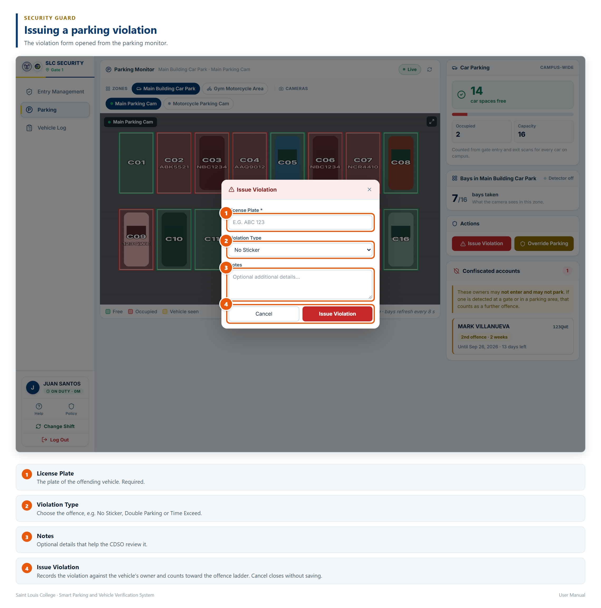

The violation form opened from the parking monitor.

1. **License Plate**: The plate of the offending vehicle. Required.
2. **Violation Type**: Choose the offence, e.g. No Sticker, Double Parking or Time Exceed.
3. **Notes**: Optional details that help the CDSO review it.
4. **Issue Violation**: Records the violation against the vehicle’s owner and counts toward the offence ladder. Cancel closes without saving.

### Vehicle Log (gate)

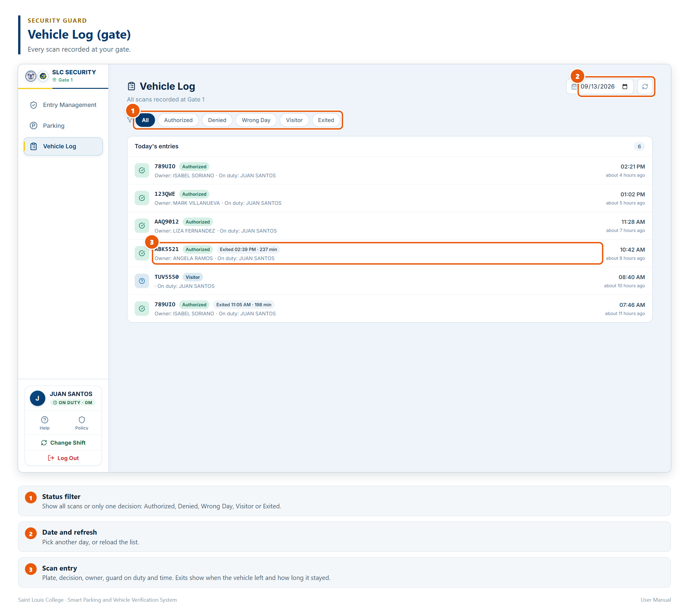

Every scan recorded at your gate.

1. **Status filter**: Show all scans or only one decision: Authorized, Denied, Wrong Day, Visitor or Exited.
2. **Date and refresh**: Pick another day, or reload the list.
3. **Scan entry**: Plate, decision, owner, guard on duty and time. Exits show when the vehicle left and how long it stayed.

## Vehicle Owner

The portal registered vehicle owners see.

### Vehicle owner portal: your pass

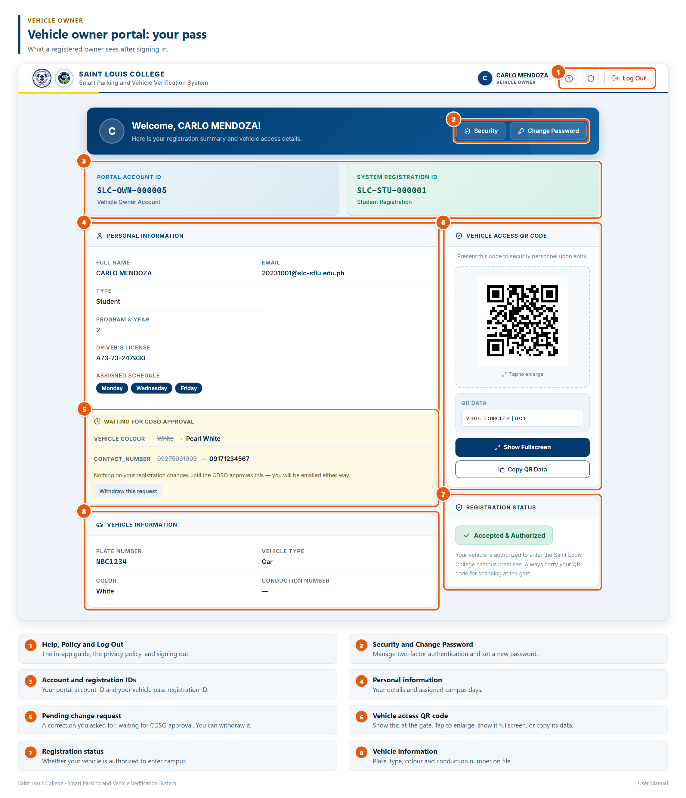

What a registered owner sees after signing in.

1. **Help, Policy and Log Out**: The in-app guide, the privacy policy, and signing out.
2. **Security and Change Password**: Manage two-factor authentication and set a new password.
3. **Account and registration IDs**: Your portal account ID and your vehicle pass registration ID.
4. **Personal information**: Your details and assigned campus days.
5. **Pending change request**: A correction you asked for, waiting for CDSO approval. You can withdraw it.
6. **Vehicle access QR code**: Show this at the gate. Tap to enlarge, show it fullscreen, or copy its data.
7. **Registration status**: Whether your vehicle is authorized to enter campus.
8. **Vehicle information**: Plate, type, colour and conduction number on file.

### Vehicle owner portal: violations & parking

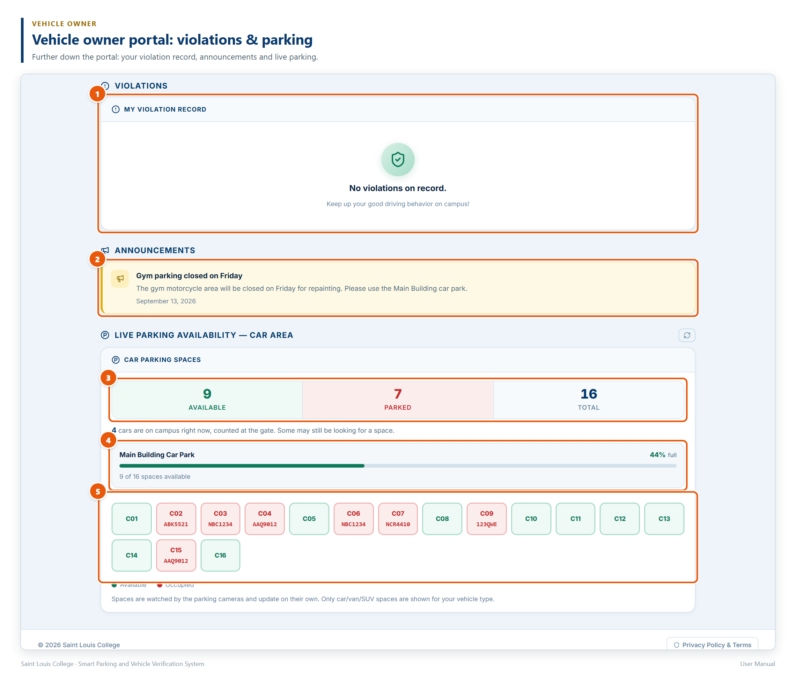

Further down the portal: your violation record, announcements and live parking.

1. **My violation record**: Any violations against your account and their status.
2. **Announcements**: Parking notices from the CDSO.
3. **Available / occupied / total**: Spaces for your vehicle type right now.
4. **Zone fill level**: How full each parking zone is.
5. **Bays**: Green bays are free; red bays are taken.

### Account security (two-factor)

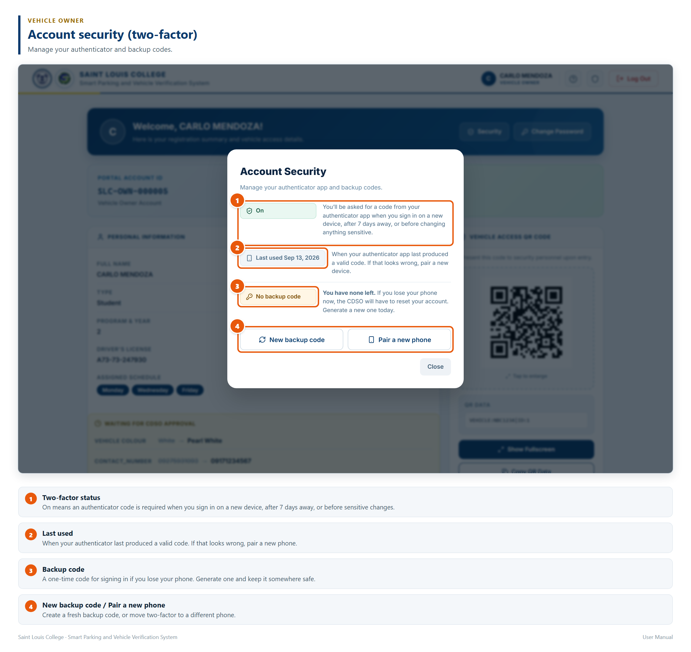

Manage your authenticator and backup codes.

1. **Two-factor status**: On means an authenticator code is required when you sign in on a new device, after 7 days away, or before sensitive changes.
2. **Last used**: When your authenticator last produced a valid code. If that looks wrong, pair a new phone.
3. **Backup code**: A one-time code for signing in if you lose your phone. Generate one and keep it somewhere safe.
4. **New backup code / Pair a new phone**: Create a fresh backup code, or move two-factor to a different phone.

## Installing the Campus System

Installing the campus system with SLC-Smart-Parking-Campus-Setup.exe.

### Step 1 · License Agreement

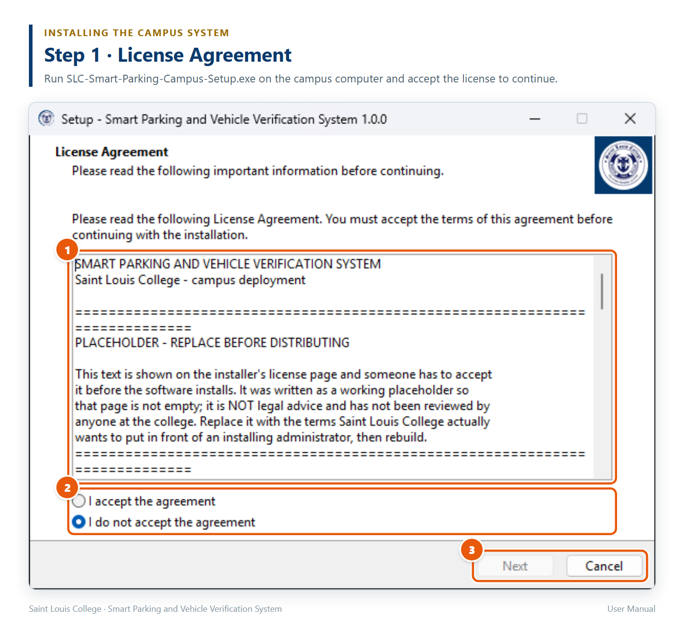

Run SLC-Smart-Parking-Campus-Setup.exe on the campus computer and accept the license to continue.

1. **License text**: Read the terms for installing the system.
2. **Accept**: Select "I accept the agreement". Next stays disabled until you do.
3. **Next / Cancel**: Next continues. Cancel quits Setup without installing anything.

### Step 2 · Choose the install folder

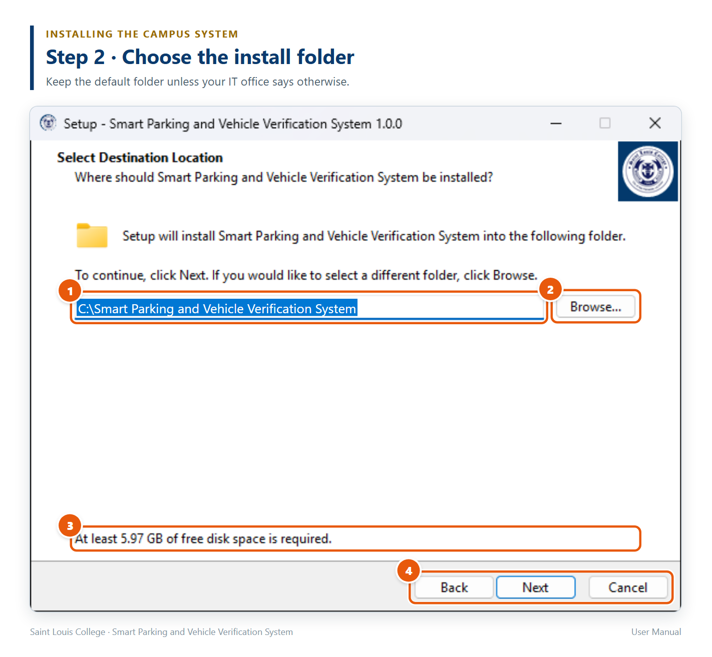

Keep the default folder unless your IT office says otherwise.

1. **Install folder**: Default: C:\Smart Parking and Vehicle Verification System. Keep the path short: Setup refuses folders longer than 110 characters.
2. **Browse...**: Pick a different folder.
3. **Disk space**: About 6 GB is needed once the Python environment and application code are downloaded.
4. **Back / Next / Cancel**: Next continues, Back returns to the previous page, and Cancel quits Setup without installing anything.

### Step 3 · Select components

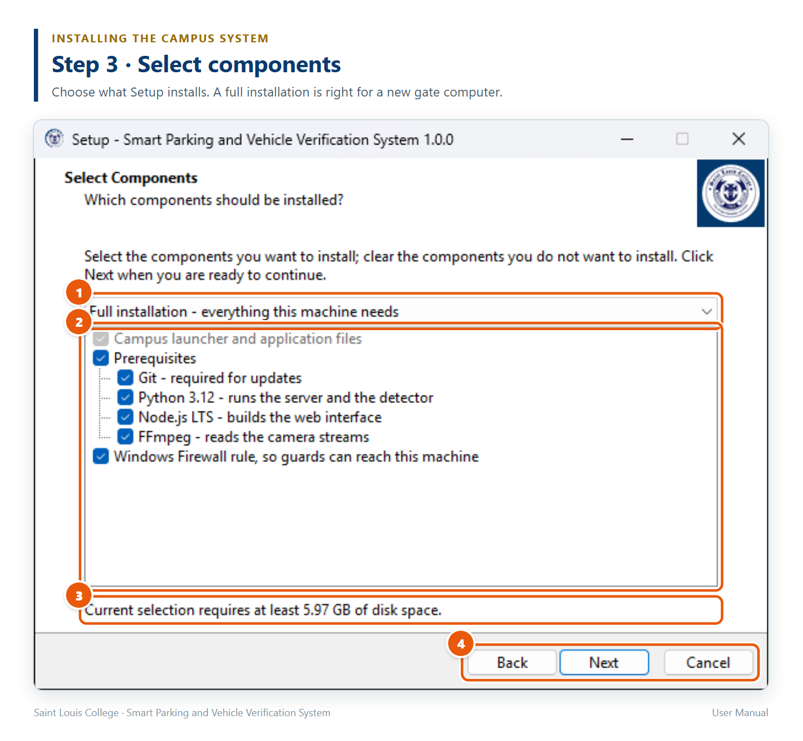

Choose what Setup installs. A full installation is right for a new gate computer.

1. **Installation type**: Full installation selects everything. Choose Custom installation to pick items yourself.
2. **Component list**: The launcher is always installed. Untick Git, Python, Node.js or FFmpeg only if your IT office already manages them. The firewall rule lets guards’ computers reach this machine.
3. **Space required**: Disk space the current selection needs.
4. **Back / Next / Cancel**: Next continues, Back returns to the previous page, and Cancel quits Setup without installing anything.

### Step 4 · Deployment options

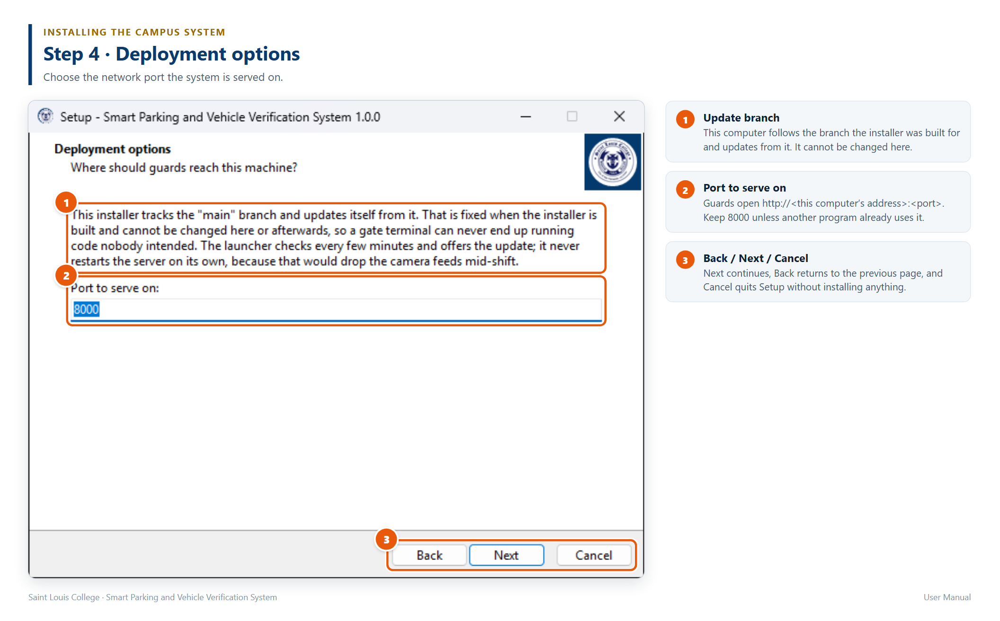

Choose the network port the system is served on.

1. **Update branch**: This computer follows the branch the installer was built for and updates from it. It cannot be changed here.
2. **Port to serve on**: Guards open http://<this computer’s address>:<port>. Keep 8000 unless another program already uses it.
3. **Back / Next / Cancel**: Next continues, Back returns to the previous page, and Cancel quits Setup without installing anything.

### Step 5 · Prerequisites check

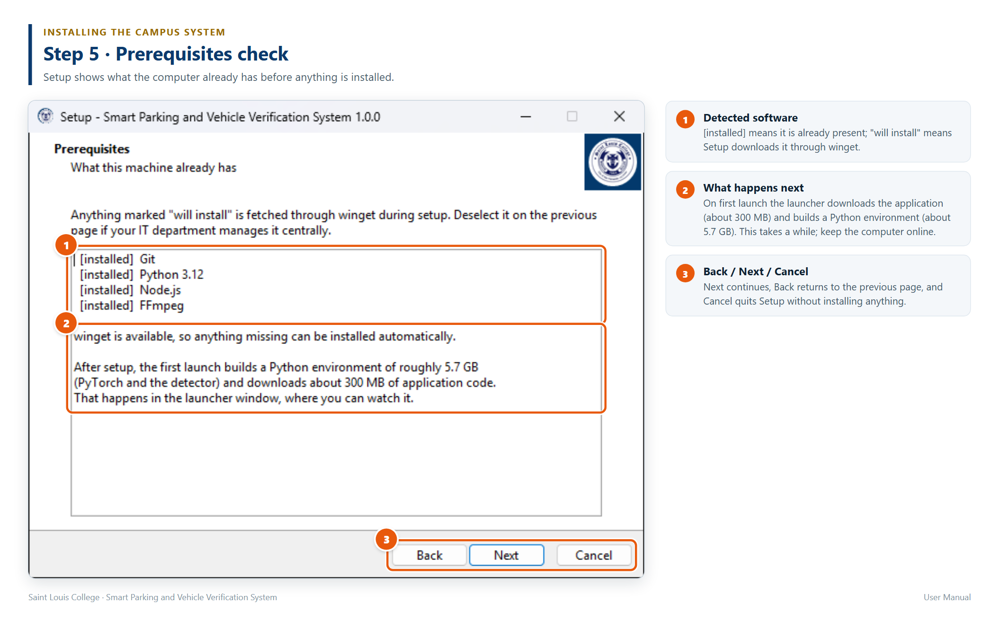

Setup shows what the computer already has before anything is installed.

1. **Detected software**: [installed] means it is already present; "will install" means Setup downloads it through winget.
2. **What happens next**: On first launch the launcher downloads the application (about 300 MB) and builds a Python environment (about 5.7 GB). This takes a while; keep the computer online.
3. **Back / Next / Cancel**: Next continues, Back returns to the previous page, and Cancel quits Setup without installing anything.

### Step 6 · Start Menu folder

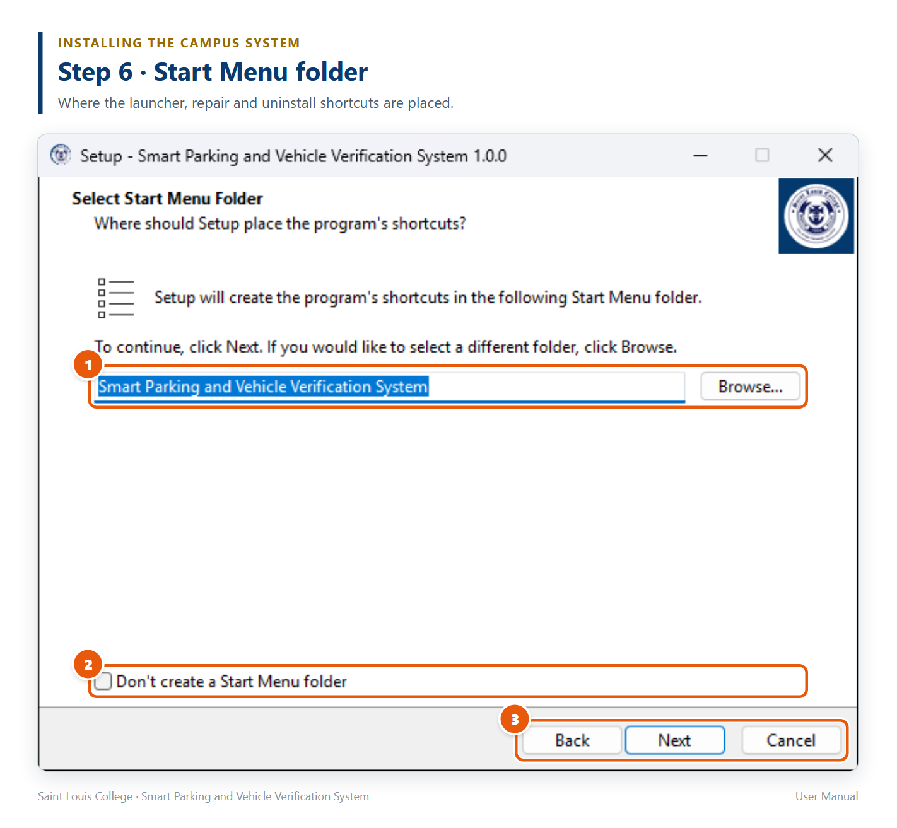

Where the launcher, repair and uninstall shortcuts are placed.

1. **Folder name**: The Start Menu folder for the shortcuts. The default is fine.
2. **No Start Menu folder**: Tick to skip creating Start Menu shortcuts.
3. **Back / Next / Cancel**: Next continues, Back returns to the previous page, and Cancel quits Setup without installing anything.

### Step 7 · Additional tasks

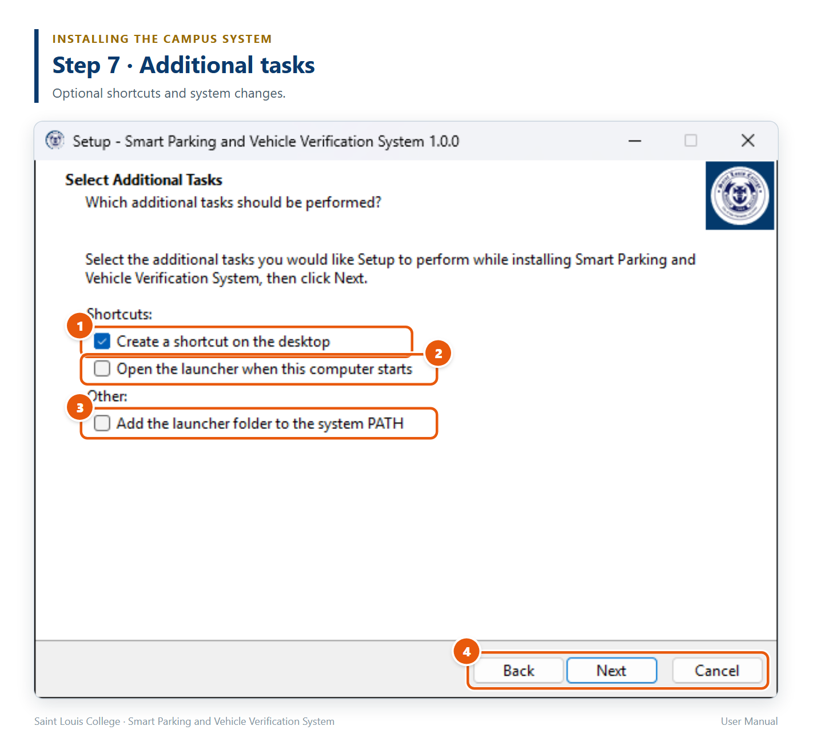

Optional shortcuts and system changes.

1. **Desktop shortcut**: Puts a launcher shortcut on the desktop (recommended).
2. **Open at startup**: Opens the launcher automatically when the computer starts. Recommended for a dedicated gate computer.
3. **Add to PATH**: For IT staff who run the launcher from a command prompt. Usually not needed.
4. **Back / Next / Cancel**: Next continues, Back returns to the previous page, and Cancel quits Setup without installing anything.

### Step 8 · Ready to install

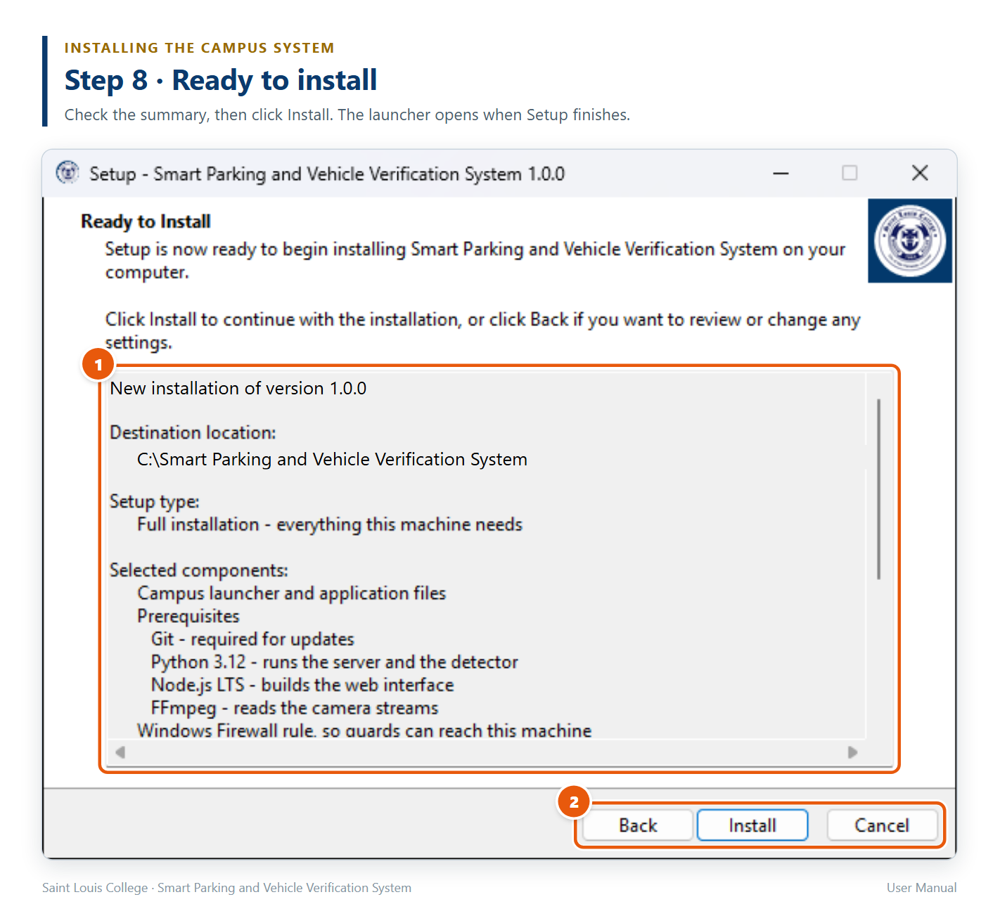

Check the summary, then click Install. The launcher opens when Setup finishes.

1. **Summary**: Install type, destination, components and tasks. Click Back to change anything.
2. **Back / Install / Cancel**: Install continues, Back returns to the previous page, and Cancel quits Setup without installing anything.

## Running the Campus System

The launcher window that runs the campus server.

### The campus launcher

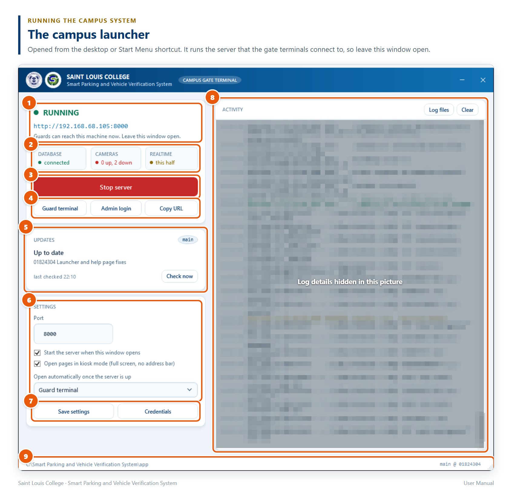

Opened from the desktop or Start Menu shortcut. It runs the server that the gate terminals connect to, so leave this window open.

1. **Server status and address**: RUNNING or STOPPED, and the address guards and CDSO staff open in their browsers.
2. **Health**: Database connection, cameras online, and whether live updates are working.
3. **Start / Stop server**: Starts or stops the system. Stopping it disconnects every gate terminal and camera.
4. **Open pages**: Guard terminal opens the gate sign-in page, Admin login opens the CDSO login, and Copy URL copies the address.
5. **Updates**: Checks for a newer version every few minutes. When one is found, click "Update and restart" at a quiet moment: restarting drops the camera feeds briefly.
6. **Settings**: Port, start the server when this window opens, kiosk mode (full screen), and which page opens automatically.
7. **Save settings / Credentials**: Save your changes. Credentials holds the shared database URL and secret key; it is only needed once per computer.
8. **Activity**: Live messages from the server. Log files opens the saved logs; Clear empties this view. Useful when reporting a problem.
9. **Install location and version**: Where the application lives and which version (branch and commit) is running.

